# Course Reflection — SysOps and Cloud Security (CSC-7308)

## Executive Summary

CSC-7308 is the **operational-defense** course in the Cambrian College Postgraduate Cybersecurity Certificate. Unlike adjacent courses that focus on offensive techniques (Ethical Hacking) or forensic analysis (IT Security Forensics), this course centers on **how an enterprise keeps systems running securely under continuous threat** — spanning firewalls, SIEM, endpoint protection, cloud posture, and containers.

The course is anchored on the **Palo Alto Networks Cybersecurity Academy** lab ecosystem (SOFv2 and CSFv2), with an open-source SIEM capstone using **Wazuh**. This combination gave hands-on exposure to both commercial enterprise tooling and open-source alternatives.

## Course Arc

The nine delivered weeks followed a deliberate progression:

```text
Weeks 1–3 │ Perimeter defense & visibility (firewall, ACC, recon prevention)
Week 4    │ SOC capstone (Wazuh SIEM, Cyber Kill Chain)
Week 5    │ Threat intelligence (AutoFocus) — feeding proactive defenses
Week 6    │ Endpoint hardening (vulnerability profiles, AV, WildFire)
Week 7    │ Cloud & container fundamentals
Weeks 8–9 │ Internet threat prevention & container networking
Weeks 10–12 │ (Not yet delivered at snapshot)
```

```mermaid
graph LR
    internet["Internet"]
    perimeter["Perimeter / NGFW<br/>Wk 1-3"]
    siem["SIEM / SOC<br/>Wk 4"]
    intel["Threat Intel<br/>Wk 5"]
    endpoint["Endpoint<br/>Wk 6"]
    cloud["Cloud<br/>Wk 7"]
    threats["Internet Threats<br/>Wk 8"]
    container["Container<br/>Wk 9"]

    internet --> perimeter --> siem --> intel --> endpoint --> cloud --> threats --> container

    classDef internetStyle fill:#718096,stroke:#4a5568,color:#fff
    classDef perimeterStyle fill:#e53e3e,stroke:#9b2c2c,color:#fff
    classDef siemStyle fill:#dd6b20,stroke:#9c4221,color:#fff
    classDef intelStyle fill:#d69e2e,stroke:#975a16,color:#fff
    classDef endpointStyle fill:#38a169,stroke:#276749,color:#fff
    classDef cloudStyle fill:#3182ce,stroke:#2c5282,color:#fff
    classDef threatStyle fill:#805ad5,stroke:#553c9a,color:#fff
    classDef containerStyle fill:#d53f8c,stroke:#97266d,color:#fff

    class internet internetStyle
    class perimeter perimeterStyle
    class siem siemStyle
    class intel intelStyle
    class endpoint endpointStyle
    class cloud cloudStyle
    class threats threatStyle
    class container containerStyle
```



The pedagogical sequence — perimeter → SIEM → intelligence → endpoint → cloud — mirrors how an organization **builds** its security posture: you do not deploy cloud-native container security before you can see and stop basic inbound threats.

## Three Mental Models That Mattered Most

### 1. Shared Responsibility in the Cloud

Every cloud adoption conversation starts with one diagram: the **shared responsibility matrix**. The boundary of "who patches what, who configures what, who monitors what" shifts across IaaS → PaaS → SaaS. Misunderstanding this boundary is the single most common source of cloud breaches.

Takeaway: **never assume the cloud provider is doing something just because it runs on their infrastructure**.

### 2. Cyber Kill Chain as a Coverage Map

Before this course, I thought of detection as "buy a SIEM, write rules, wait for alerts." The Kill Chain reframes detection as a **coverage problem**: at each of seven stages (recon → weaponization → delivery → exploitation → installation → C2 → objectives), which controls can see what the attacker is doing?

Takeaway: **a security program should be audited by which kill-chain stages it can detect**, not by which products it owns.

### 3. Prevention-First Architecture (Palo Alto Philosophy)

The Palo Alto Networks approach is unabashedly prevention-biased: block before detect, inspect at line rate, correlate with cloud intelligence. The AutoFocus integration with NGFWs operationalizes this — instead of SOC analysts manually pivoting on IoCs, the firewall already has them.

Takeaway: **detect-respond is necessary but expensive; prevent-at-perimeter is cheaper when you can do it**.

## Technical Depth Gained

| Area | Before | After |
|---|---|---|
| Firewall operations | Conceptual (rules, zones) | Hands-on policy refinement, log analysis, zone protection |
| SIEM | Never deployed one | Wazuh architecture + rule tuning + active response |
| Threat intelligence | Theoretical | AutoFocus + IoC pipelines + blocklist automation |
| Cloud security | Buzzword-level | Shared responsibility, CASB, Prisma concepts |
| Container security | Docker-compose user | Defender for Containers + K8s network policies |

## Cross-Course Connections

CSC-7308 connects outward to every other course in the program:

- **CSC-7303 Network Defense** — Upstream context: network architecture, segmentation, monitoring.
- **CSC-7311 Ethical Hacking** — The adversary side of everything this course defends.
- **CSC-7310 IT Security Forensics** — Post-incident work that starts where SOC triage ends.
- **CSC-7312 Malware Analysis** — What WildFire and endpoint protection are actually classifying.
- **CSC-7307 Cybersecurity Capstone** — Integrates operational defense with program-wide concepts.

## Independent Work

Beyond the assigned labs, I built an **async Rust ping-sweep CLI tool** as an extension to Week 2 (Application Command Center + Network Tools). The tool demonstrates:

- Tokio async runtime for concurrent ICMP operations
- Thread-safe channel communication (MPSC)
- Subnet arithmetic and IPv4 manipulation
- CLI user-input handling with proper error management

See [`scripts/ping_sweep/`](scripts/ping_sweep/) for the code, flow diagram, and detailed walkthrough. This work was not required — it was a deliberate exercise to deepen understanding of network-scanning mechanics that underpin both offensive recon and defensive monitoring.

## Honest Limitations of This Snapshot

- **Weeks 10–12 not delivered** at portfolio snapshot date. Final assessment pending.
- **Team deliverables incomplete** — the Build a SOC group project has Part 1 submitted; full team report still in progress.
- **Video lectures excluded** — ~1.5 GB of MP4 files are stored locally, not in repository.

## What I Would Do Differently

1. **Capture evidence incrementally.** Wait until end-of-term to extract screenshots and you lose context. Snap-and-caption during the lab is 10× faster than reconstruction.
2. **Deploy Wazuh earlier.** Waiting until Week 4's group assignment compressed the SIEM learning curve. A personal Wazuh lab in Week 1 would have made every subsequent week richer.
3. **Build the NGFW lab locally.** The SOFv2 labs ran in Palo Alto's cloud environment. Mirroring them on a local `pfSense` or `OPNsense` would have doubled the depth.

## Forward Links

- [Build a SOC project writeup](MIDTERM_PROJECT_SUMMARY.md)
- [All weekly summaries](weekly/)
- [Original Rust ping-sweep code](scripts/ping_sweep/)

---

*Last updated: 2026-04-04.*
