# Evidence & Screenshots Index

This guide groups evidence by week/topic and links each artifact with a short caption. Screenshots were extracted from lab submission DOCX files and follow the naming convention `wkNN_topic_index.png`.

**Total evidence artifacts: 44 screenshots + 4 diagrams/code files**

---

## Week 01 — Firewall Log Analysis (3 screenshots)

| # | Screenshot | Description |
|---|---|---|
| 1 |  | Task Manager confirming named configuration loaded successfully — prerequisite for all subsequent lab tasks |
| 2 |  | `timedatectl` output confirming NTP synchronization active — critical for cross-device log correlation |
| 3 |  | Traffic log detail: Session ID **419**, NAT destination **91.189.91.48**, URL category **computer-and-internet-info** |

## Week 02 — Application Command Center (6 screenshots)

| # | Screenshot | Description |
|---|---|---|
| 1 |  | Load Named Configuration dialog — `pan-sof-lab-02.xml` selected for ACC lab |
| 2 |  | Simulated malware traffic generation script output — populating ACC with C2 patterns |
| 3 |  | ACC threat activity widget — **Bredolab.Gen C2 Traffic** detected, ranked high severity |
| 4 |  | ACC threat detail panel — metadata for Bredolab.Gen C2 detection |
| 5 |  | ACC filtered view confirming **Bredolab.Gen Command and Control Traffic** identification |
| 6 |  | Detailed threat log: source IP, destination IP, application, action taken, triggering signature |

**Original work (preserved):**

- [`scripts/ping_sweep/ping-sweep-diagram.svg`](scripts/ping_sweep/ping-sweep-diagram.svg) — Flow diagram of async ping-sweep tool
- [`scripts/ping_sweep/ping-sweep-flow.mermaid`](scripts/ping_sweep/ping-sweep-flow.mermaid) — Mermaid source for flow diagram
- [`scripts/ping_sweep/src/main.rs`](scripts/ping_sweep/src/main.rs) — Rust source code

## Week 03 — Reconnaissance Attack Prevention (7 screenshots)

| # | Screenshot | Description |
|---|---|---|
| 1 | 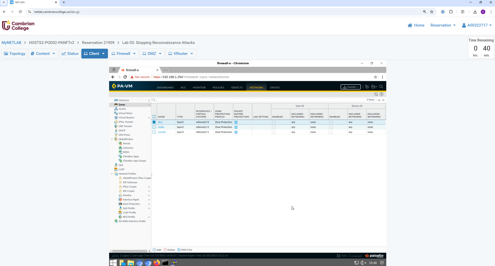 | Zone Protection Profile creation — reconnaissance detection settings enabled |
| 2 | 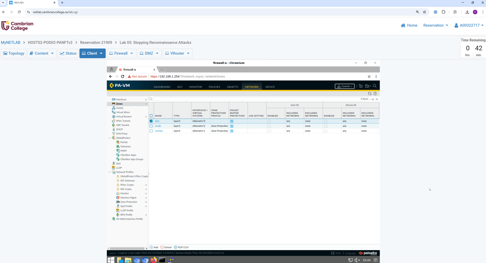 | Zone Protection Profile configuration finalized — thresholds defined |
| 3 | 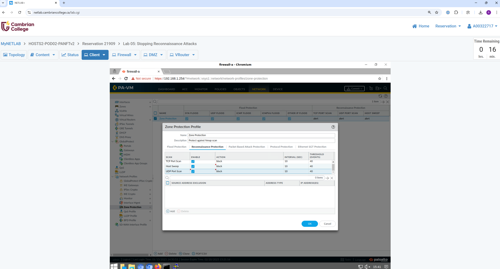 | DMZ zone selected for Zone Protection Profile assignment |
| 4 | 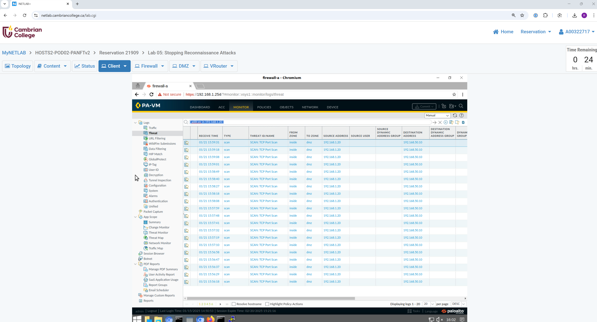 | Profile applied to **3 zones** (trust, untrust, dmz) — full coverage confirmed |
| 5 | 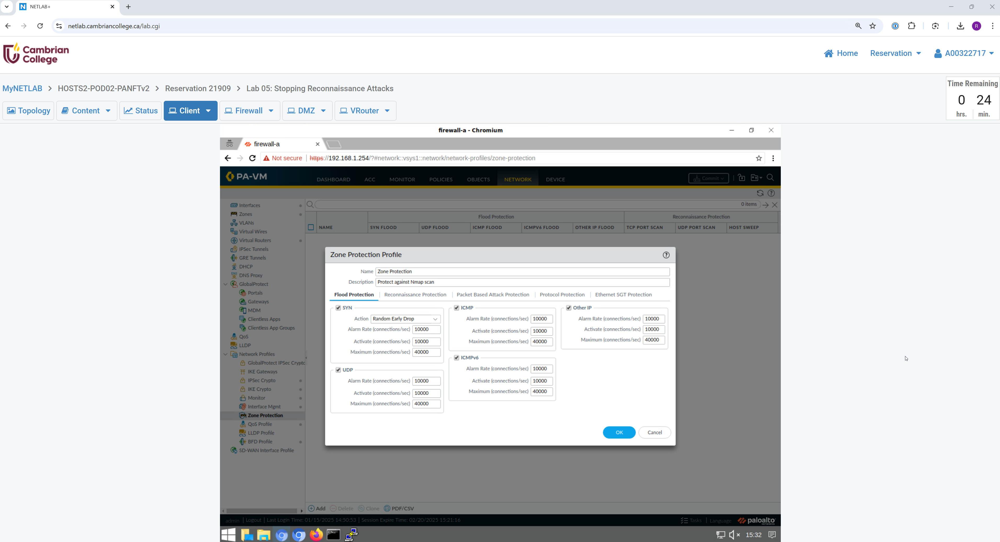 | Zenmap GUI ready to scan DMZ server at **192.168.50.10** |
| 6 | 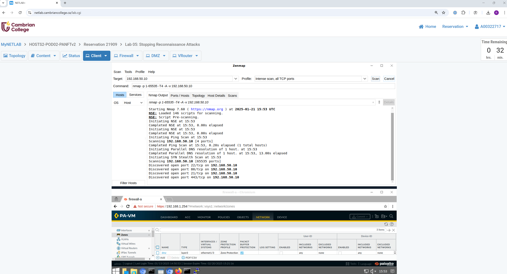 | Zenmap scan results after nmap reconnaissance against DMZ server |
| 7 | 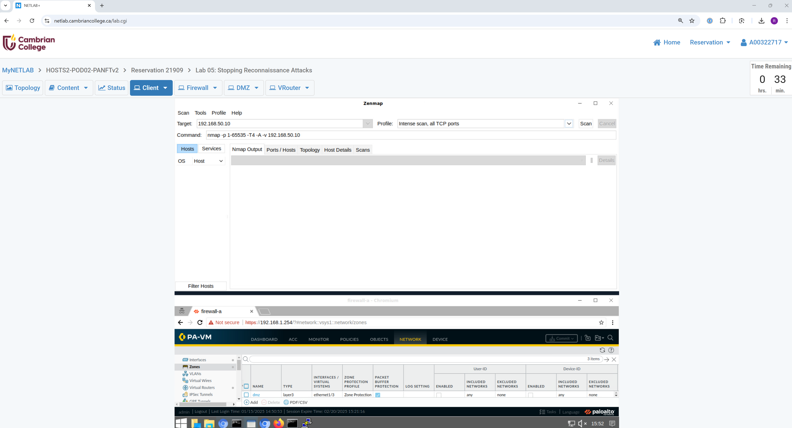 | Threat log: reconnaissance detected — attacker **192.168.1.20** → victim **192.168.50.10** |

## Week 04 — Build a SOC / Cyber Kill Chain (4 screenshots)

| # | Screenshot | Description |
|---|---|---|
| 1 |  | Cyber Kill Chain quiz — page 1: 7-stage framework knowledge assessment |
| 2 |  | Cyber Kill Chain quiz — page 2: defensive countermeasures per stage |
| 3 |  | Networking Concepts Part 2 — page 1: TCP/IP, subnetting, DNS |
| 4 |  | Networking Concepts Part 2 — page 2: routing and protocol analysis |

## Week 05 — Threat Intelligence / MineMeld (5 screenshots)

| # | Screenshot | Description |
|---|---|---|
| 1 | 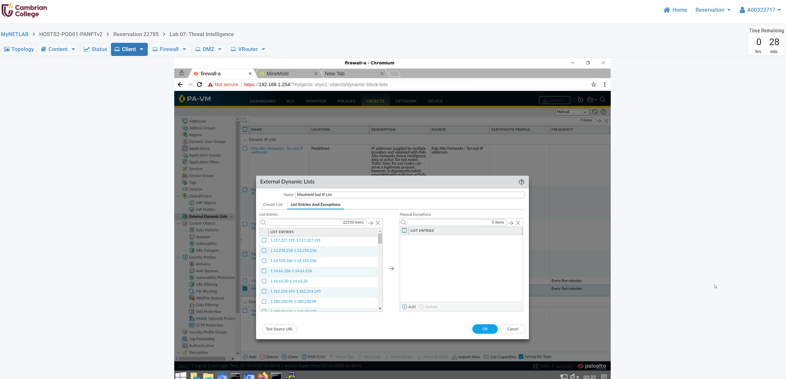 | Docker volumes created for MineMeld persistent storage — deployment verification |
| 2 | 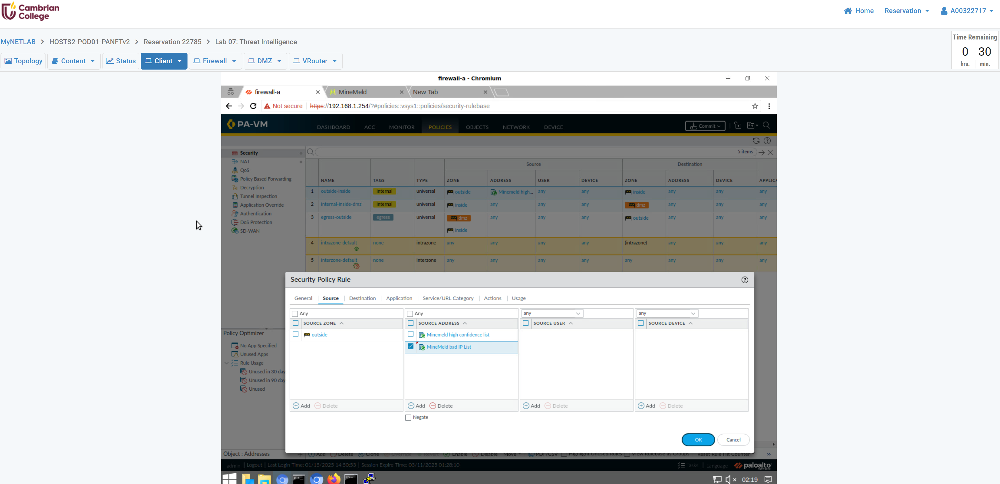 | `docker-compose.yml` in vi — MineMeld service definition, ports, and volume mounts |
| 3 | 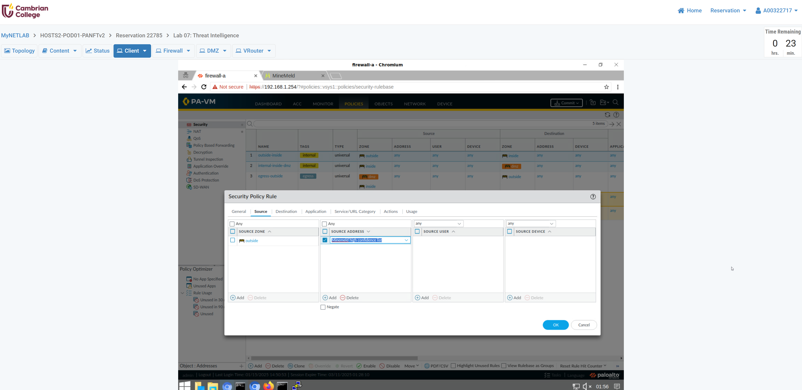 | PAN-OS EDL config — MineMeld high-confidence indicator list integrated into security policy |
| 4 | 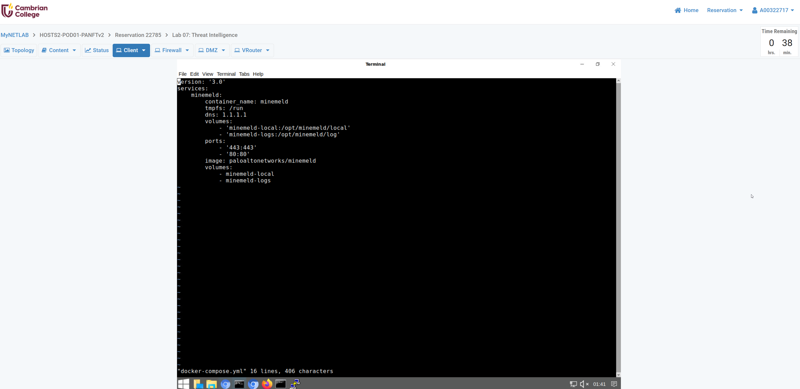 | PAN-OS EDL config — MineMeld bad IP list added as second threat feed source |
| 5 | 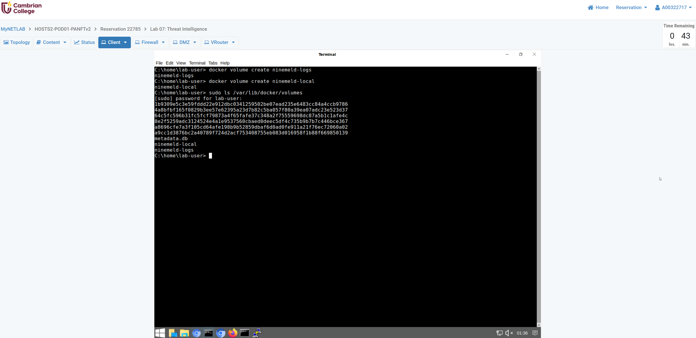 | EDL panel — block list indicators populated and available for policy enforcement |

## Week 06 — Endpoint Security & Vulnerability Profiles (9 screenshots)

| # | Screenshot | Description |
|---|---|---|
| 1 |  | Dynamic updates panel — AV update packages available for download |
| 2 |  | AV update installation confirmed — signatures current |
| 3 |  | Content update: `panupv2-all-contents-8624-7617` available (version mismatch with lab guide) |
| 4 |  | Manual Applications and Threats content update installation in progress |
| 5 |  | Content version `8624-7617` confirmed as "Currently Installed" with checkmark |
| 6 |  | Custom vulnerability signature — general settings and threat metadata defined |
| 7 |  | Custom vulnerability signature — pattern matching rules and conditions |
| 8 |  | Commit dialog — configuration successfully pushed to firewall |
| 9 |  | Threat log — vulnerability events detected, confirming protection profile is active |

## Week 07 — Cloud Computing & Containers

_No lab screenshots — this was a lecture-only week. Concepts are documented in the [weekly summary](weekly/week-07-cloud-computing-containers.md) and reinforced with hands-on labs in Weeks 8–9._

## Week 08 — Internet Threat Prevention (4 screenshots)

| # | Screenshot | Description |
|---|---|---|
| 1 |  | File blocking profile attached to security policy rule — enforcement active |
| 2 |  | Blocked file download — firewall intercepted `.exe`/`.scr`/`.hta` transfer |
| 3 |  | Firewall block page displayed to user after prohibited file download attempt |
| 4 |  | Threat log entry confirming file blocking action with file type and policy details |

## Week 09 — Container Networking & Security (6 screenshots)

| # | Screenshot | Description |
|---|---|---|
| 1 |  | `docker images` — Ubuntu container image pulled from Docker Hub |
| 2 |  | `docker inspect` JSON — container network configuration and metadata |
| 3 |  | Container internal IP **172.16.3.2** extracted from inspect output |
| 4 |  | Inter-container `ping` — connectivity confirmed between containers on bridge network |
| 5 |  | `docker ps` — nginx container with port mapping **8080:80** visible |
| 6 |  | nginx default welcome page at **http://192.168.50.10:8080** — service accessible from host |

---

## Diagrams & Code Artifacts (Original Work)

| File | Description |
|---|---|
| [`scripts/ping_sweep/ping-sweep-diagram.svg`](scripts/ping_sweep/ping-sweep-diagram.svg) | Flow diagram showing async ping-sweep state machine |
| [`scripts/ping_sweep/ping-sweep-flow.mermaid`](scripts/ping_sweep/ping-sweep-flow.mermaid) | Mermaid source for flow diagram |
| [`scripts/ping_sweep/src/main.rs`](scripts/ping_sweep/src/main.rs) | Rust async ping-sweep source code |
| [`scripts/ping_sweep/code-explanation.md`](scripts/ping_sweep/code-explanation.md) | Detailed line-by-line walkthrough of Rust implementation |

---

*Last updated: 2026-04-05. 44 screenshots extracted from lab submission documents.*
