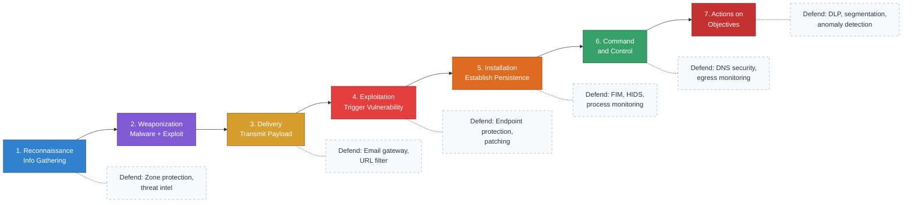
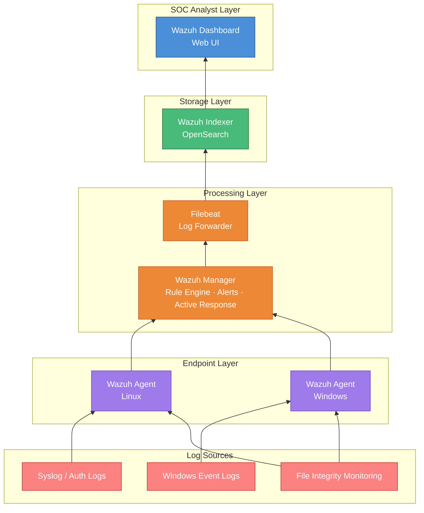

# Midterm Project — Build a SOC (Group Capstone)

## Project Overview

The midterm capstone for CSC-7308 was a **group assignment** titled **"Open-Source SOC 2025"**. The objective: design and implement a functional Security Operations Center (SOC) built around the **Wazuh open-source SIEM** platform, demonstrating end-to-end log collection, threat detection, alert correlation, and incident response.

Teams were asked to apply the **Cyber Kill Chain** framework to map attacker tactics to defender response actions, producing both a working deployment and a written technical report.

## Context & Motivation

Commercial SIEM products (Splunk, QRadar, Sentinel) dominate enterprise SOC deployments but carry significant licensing costs. **Wazuh** is the leading open-source alternative — a fork of OSSEC with integrated ELK-stack analytics, native rule engine, and agent-based HIDS/FIM capabilities. Building a SOC around Wazuh exercises the full defender workflow without gating on licensing.

## Team Structure

- **Team Size:** 4+ students per group
- **Role:** Portfolio owner contributed **Part 1 — Cyber Kill Chain** analysis
- **Other team members:** Not named in this public portfolio (see Privacy policy)

## Deliverables

| # | Deliverable | Scope | Status |
|---:|---|---|---|
| 1 | **Wazuh SIEM Deployment** | Manager + agents + Kibana/Wazuh UI | Team |
| 2 | **SOC Architecture Diagram** | Log sources, pipelines, analyst workflow | Team |
| 3 | **Cyber Kill Chain Mapping** | 7-stage framework → detection coverage | Individual (Part 1) |
| 4 | **Threat Detection Rules** | Custom Wazuh rule sets | Team |
| 5 | **Incident Response Runbooks** | Procedures for top-N alert classes | Team |
| 6 | **Written Technical Report** | Full architecture + justification | Team |

## Part 1 Contribution: Cyber Kill Chain

The Cyber Kill Chain (Lockheed Martin, 2011) decomposes an attack into seven sequential stages. For each stage, the contribution mapped:

1. **Reconnaissance** — information gathering about target environment
2. **Weaponization** — coupling malware to an exploit
3. **Delivery** — transmitting the weaponized payload
4. **Exploitation** — triggering the vulnerability
5. **Installation** — establishing persistence
6. **Command & Control (C2)** — remote attacker communication
7. **Actions on Objectives** — data exfiltration, lateral movement, impact

For each stage, the analysis paired:

- **Attacker techniques** (e.g., port scanning in recon; phishing in delivery)
- **Wazuh detection capabilities** (e.g., rule `5710` for SSH brute force, rule `86601` for IDS alerts)
- **Defender response actions** (alert, block via active-response scripts, tune rules)

## Wazuh Architecture (Team Design)

The group architecture included:

### Core Components

- **Wazuh Manager** — Central processing node (rule engine, log analysis, alerts)
- **Wazuh Indexer** (OpenSearch) — Event storage and search
- **Wazuh Dashboard** — Web UI for SOC analysts
- **Wazuh Agents** — Endpoint collectors (Linux/Windows hosts)
- **Filebeat** — Log forwarder

### Log Sources Integrated

- Windows Event Logs
- Linux syslog, auth logs, audit logs
- File Integrity Monitoring (FIM) on sensitive directories
- Optional: firewall syslog, DNS query logs, web server access logs

### Detection Capabilities Exercised

- Brute-force login attempts (SSH, RDP)
- Unauthorized file modifications (FIM)
- Privilege escalation attempts
- Rootkit detection
- Policy non-compliance (CIS benchmarks)

## Skills Demonstrated

### Technical
- SIEM architecture (manager, indexer, dashboard separation of concerns)
- Log source integration and normalization
- Rule-based detection engineering
- Alert triage and severity scoring
- Active response automation (`firewall-drop.sh`, `disable-account.sh`)

### Analytical
- Attacker-defender mindset via Cyber Kill Chain
- Threat modeling through structured frameworks
- Risk prioritization by stage of kill chain

### Collaborative
- Distributed deliverables across team members
- Technical writing for a mixed audience (technical + management)
- Integration of individual contributions into unified report

## Artifacts Referenced

- **Wazuh Project.pdf** (3.4 MB) — Platform architecture, features, deployment (Wazuh Inc. — referenced only, not redistributed)
- **Wazuh Lab Documentation.docx** (6.3 MB) — Step-by-step configuration guide (course material — referenced only)
- **Open-Source SOC 2025.docx** — Assignment specification (course material — referenced only)
- Student's own Part 1 submission (DOCX) — sanitized PDF in [`assignments/`](assignments/) when available

## Evidence

See [`EVIDENCE_INDEX.md`](EVIDENCE_INDEX.md) for screenshots and diagrams. Evidence gathering is in progress; expected artifacts:

- Wazuh Manager dashboard (overview, alerts, agents)
- Rule-triggered alert examples (SSH brute force, FIM change)
- Active-response firewall block demonstration
- Cyber Kill Chain stage-to-rule mapping table

## Reflection

This capstone crystallized the shift from **prevention-only** (firewalls, AV) to **detection-and-response** thinking. A SOC is not just tools — it is a **process** where humans, detection rules, and response playbooks combine. Running Wazuh locally showed the cost-effective path to enterprise-grade visibility, and applying the Cyber Kill Chain to the rule set sharpened the mental model of *where* detection has to happen and *which* techniques are visible at each stage.

Key takeaways:

1. **Defense-in-depth is layered by kill-chain stage.** No single control stops every attack; coverage must span recon through objectives.
2. **Open-source SIEM is viable** for small-to-medium environments and educational labs.
3. **Alerts without runbooks are noise.** The human side of SOC operations is as important as the tooling.

## Status

- ✅ Part 1 (Cyber Kill Chain mapping) submitted
- ✅ Lab screenshots extracted and indexed in [`EVIDENCE_INDEX.md`](EVIDENCE_INDEX.md)
- 🟡 Team deliverables in progress at portfolio snapshot

---

*Last updated: 2026-04-04.*
