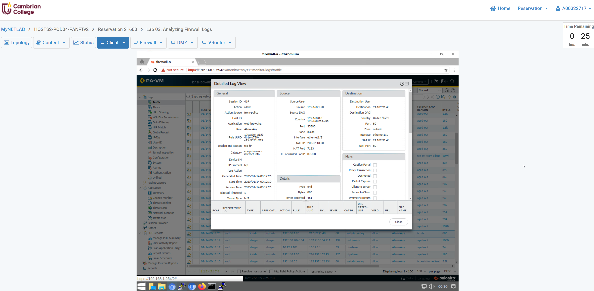
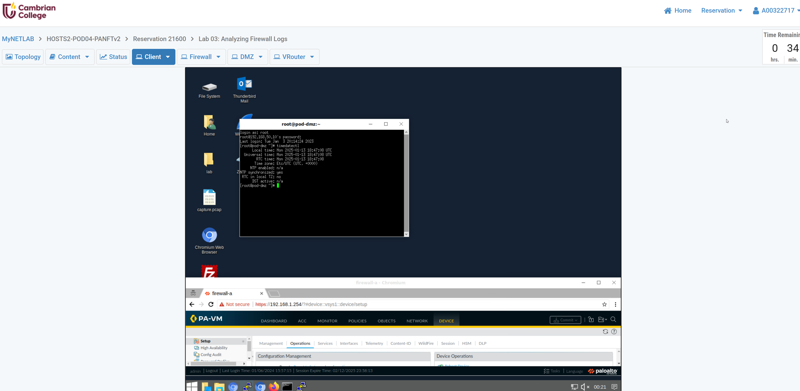
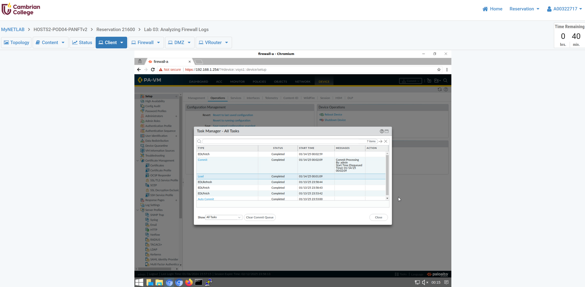

# Lab 03 — Analyzing Firewall Logs

- Section: 1.0 Step 12 - In the Task Manager \> All Tasks window, verify that the Load type has successfully completed (Ill check the start time).

- Section: 1.1 Step 4 - Type the command "timedatectl" after login in as "root" (Screen shot of the result).

- Section: 1.2 Step 7 - What is the Session ID, NAT IP of Destination user and Category of your selected log? Please specify with screenshot.

Session ID: 419

NAT IP of Destination user: 91.189.91.48

Category of your selected log: computer-and-internet-info

