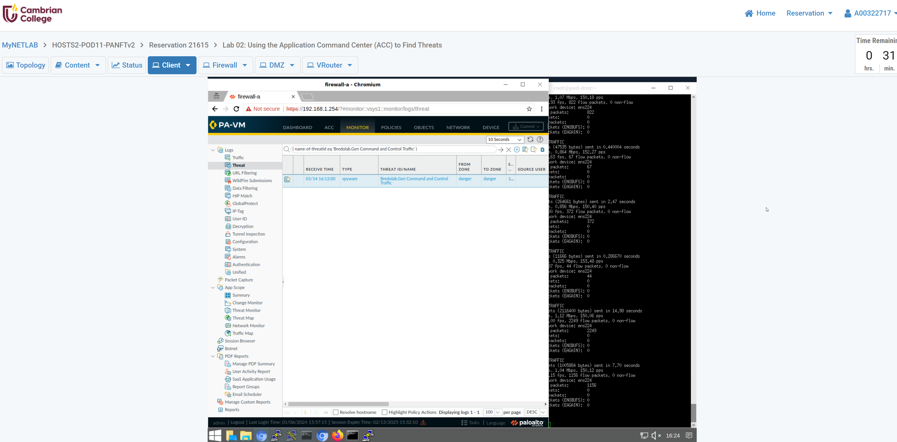
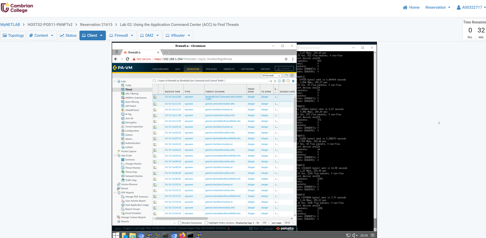
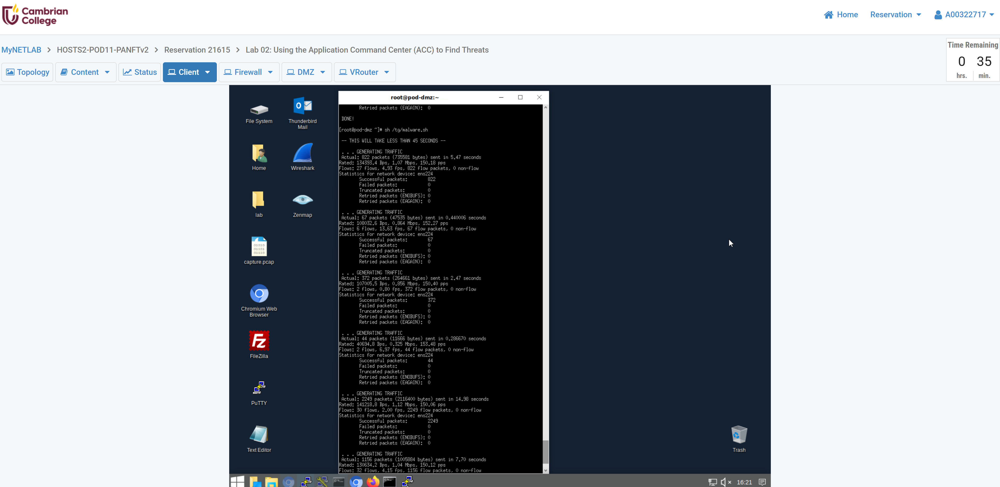
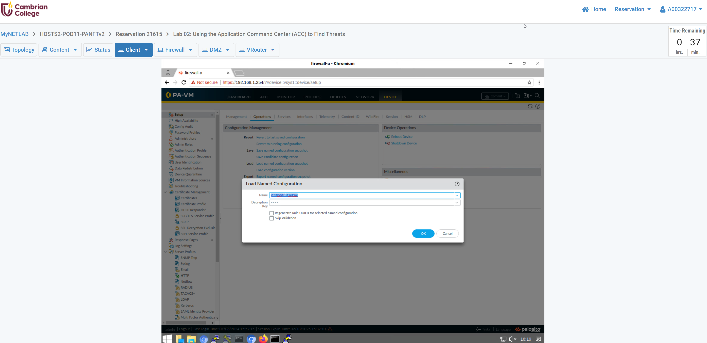
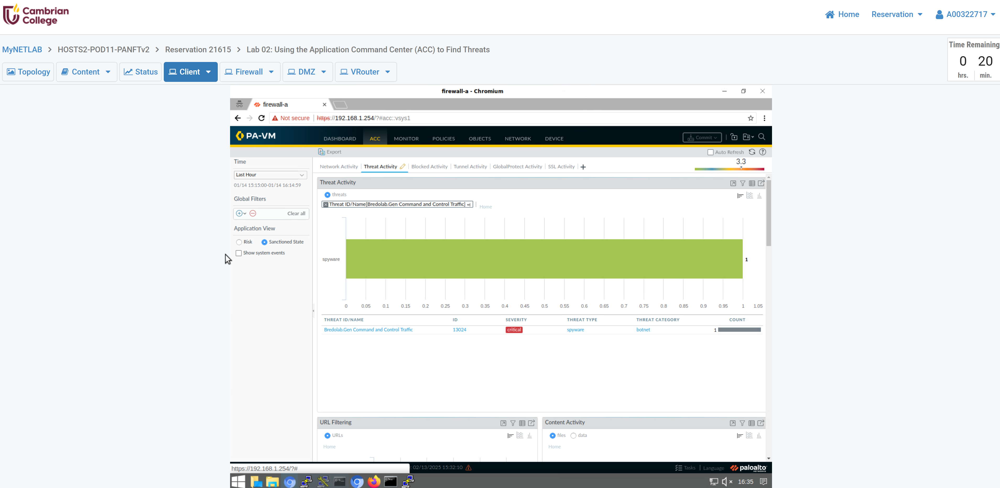
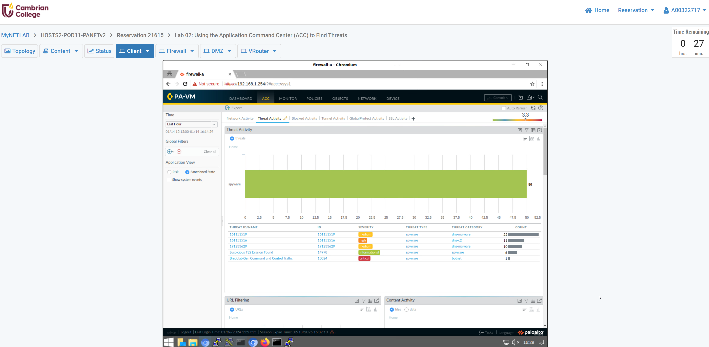

# Lab 02 — Using the Application Command Center (ACC)

> **Course:** SysOps and Cloud Security (CSC-7308) — Winter 2025, Cambrian College
> **Week:** 2
> **Lab Environment:** Palo Alto Networks SOFv2

## Executive Summary

This lab explored the Application Command Center (ACC) — PAN-OS's primary analytics dashboard that aggregates threat, application, and traffic data into interactive widgets for SOC analysts. The exercise involved loading a dedicated lab configuration (`pan-sof-lab-02.xml`), generating simulated malware traffic, and using the ACC to identify and investigate **Bredolab.Gen Command and Control Traffic**. The lab demonstrated how the ACC enables rapid threat visibility without writing manual log queries.

---

## 1.0 — Load Named Configuration

**Objective:** In the Load Named Configuration window, select `pan-sof-lab-02.xml` from the Name dropdown and click OK.

Loading the lab-specific configuration (`pan-sof-lab-02.xml`) ensures the firewall has the correct security policies, logging profiles, and threat-prevention settings needed to detect the simulated malware traffic in subsequent steps.

---

## 1.1 — Generate Simulated Malware Traffic

**Objective:** Allow the script to generate malware traffic so the ACC has threat data to display.

The lab script injects traffic patterns that mimic real-world malware command-and-control (C2) communications. This controlled simulation populates the firewall's threat logs and ACC widgets, providing realistic data for analysis without exposing the network to actual threats.

---

## 1.2 — Identify Threat in the ACC

### Step 3 — Locate the Bredolab.Gen C2 Entry

**Objective:** In the ACC threat activity widget, locate an entry where the **Threat ID/Name** column includes **Bredolab.Gen Command and Control Traffic**.

The ACC aggregates threat events and ranks them by severity and volume, allowing analysts to quickly spot the most critical detections. Bredolab.Gen C2 traffic appeared in the threat widget as a high-severity entry.

### Step 6 — Confirm Threat Identification

**Objective:** Confirm the identified threat is **Bredolab.Gen Command and Control Traffic**.

Drilling into the specific threat entry reveals the full context: source and destination IPs, the application identified, the action the firewall took (alert/block), and the threat signature that triggered the detection. This workflow mirrors how a SOC analyst would triage a real C2 alert.

---

## Security Significance / Analysis

The Application Command Center is a force-multiplier for SOC operations on Palo Alto Networks firewalls. This lab highlighted several key takeaways:

1. **Centralized threat visibility** — The ACC consolidates threat, application, and traffic data into a single dashboard, eliminating the need to manually query separate log types during initial triage.
2. **C2 detection** — Bredolab is a well-known botnet family whose C2 traffic pattern is detected by Palo Alto's threat-prevention signatures. Identifying C2 communications is one of the highest-priority tasks in a SOC because it indicates an active compromise with ongoing attacker control.
3. **Drill-down workflow** — The ACC's widget-to-detail navigation (summary → filtered view → individual log entry) models the analyst workflow of moving from broad situational awareness to specific indicator extraction.
4. **Simulated traffic for training** — Using controlled traffic-generation scripts allows analysts to practice detection and triage without live threats, building muscle memory for real incident response.

These ACC skills directly support the threat-monitoring and incident-triage competencies required for SOC analyst roles.