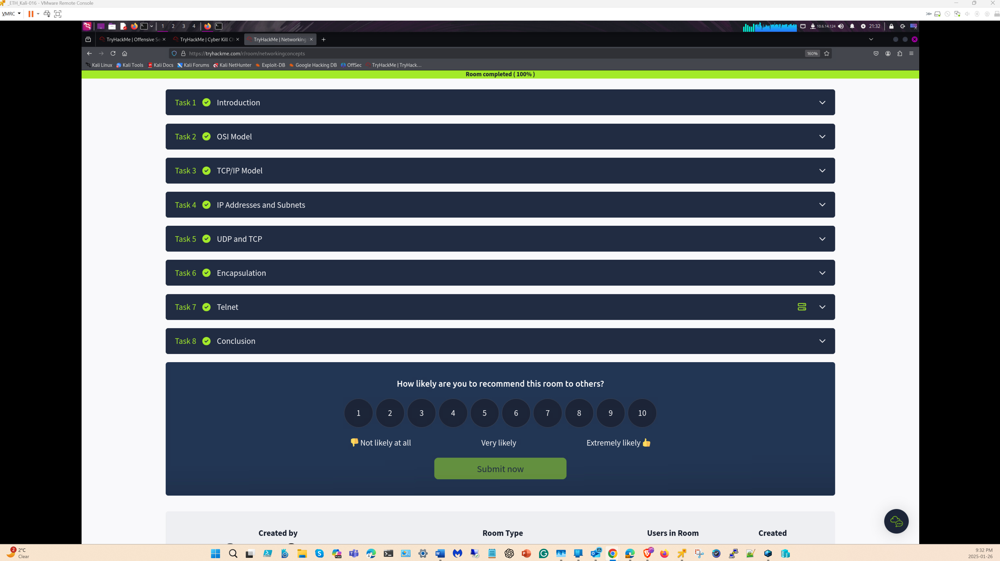
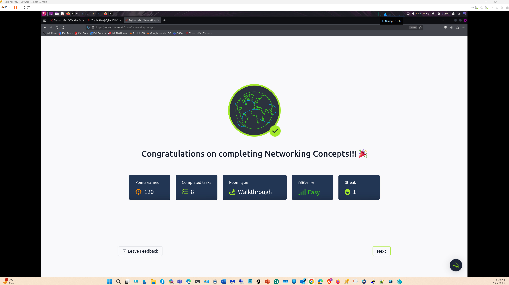
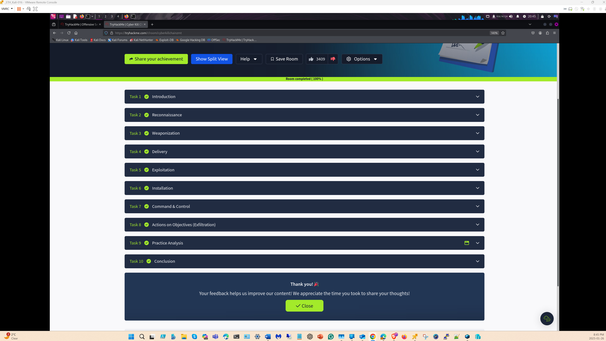
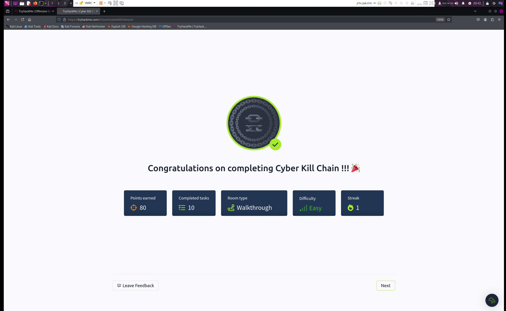

# Cyber Kill Chain — Part 1

**Course:** SysOps and Cloud Security (CSC-7308) — Week 4
**Student:** Ross Moravec

---

## Executive Summary

This assignment consists of two knowledge assessments evaluating foundational understanding of the Lockheed Martin Cyber Kill Chain framework and core networking concepts. The Cyber Kill Chain quiz validates comprehension of the seven-stage intrusion model that underpins enterprise detection and response strategies. The Networking Concepts (Part 2) assessment confirms proficiency in TCP/IP fundamentals, subnetting, DNS, and routing — prerequisite knowledge for firewall configuration, packet analysis, and network-based attack detection covered in subsequent labs.

---

## Methodology

| Element | Detail |
|---|---|
| **Assessment type** | Knowledge-based quiz (not hands-on lab) |
| **Frameworks assessed** | Lockheed Martin Cyber Kill Chain (7 stages), TCP/IP networking fundamentals |
| **Approach** | Complete both timed assessments, then analyze the frameworks in the context of course lab work |
| **Scope** | Part 1: Kill Chain stages, attacker TTPs, defensive countermeasures per stage; Part 2: Subnetting, DNS, routing, TCP/IP model |

---

## Part 1 — Cyber Kill Chain Quiz

## Part 2 — Networking Concepts (Part 2)

**Ross Moravec — Networking Concepts (Part 2) taken Jan 26th, 2025**

---

## Findings — Kill Chain Stage Analysis

The seven stages of the Lockheed Martin Cyber Kill Chain, mapped to the defensive controls encountered across course labs:

| Stage | Attacker Activity | Defensive Control (Course Labs) | Detection Opportunity |
|---|---|---|---|
| **1. Reconnaissance** | Network scanning, OSINT, port enumeration | Zone Protection Profiles (Lab 05, Wk 3) | Threat log entries for scan patterns |
| **2. Weaponization** | Exploit crafting, payload packaging | Threat intelligence feeds, WildFire (Wk 5) | N/A — occurs off-network |
| **3. Delivery** | Phishing, drive-by download, USB | File blocking profiles (Lab 02, Wk 8), URL filtering | Blocked file downloads, URL alerts |
| **4. Exploitation** | Vulnerability exploit execution | Vulnerability Protection profiles (Lab 06, Wk 6) | Threat log: exploit signature matches |
| **5. Installation** | Malware persistence, backdoor placement | Endpoint protection, custom vuln signatures (Wk 6) | AV/anti-spyware detection |
| **6. Command & Control** | C2 channel establishment | ACC threat detection (Lab 02, Wk 2), EDLs (Wk 5) | C2 traffic in ACC, EDL-blocked IPs |
| **7. Actions on Objectives** | Data exfiltration, lateral movement | Network segmentation, container isolation (Wk 9) | Anomalous traffic patterns, SIEM alerts |

## Findings — Networking Concepts

| Concept | Relevance to Security Operations |
|---|---|
| **TCP/IP model** | Understanding protocol layers is essential for interpreting packet captures and firewall log entries |
| **Subnetting (CIDR)** | Directly applied in firewall zone configuration, security policy rules, and the Rust ping sweep tool |
| **DNS resolution** | DNS security policies (Wk 8) rely on understanding query/response flows and poisoning risks |
| **Routing** | Inter-zone traffic flow depends on routing tables; misconfigured routes create security blind spots |

---

## Security Significance & Analysis

- The **Lockheed Martin Cyber Kill Chain** describes seven stages of a cyber intrusion: Reconnaissance, Weaponization, Delivery, Exploitation, Installation, Command & Control (C2), and Actions on Objectives. Understanding this model is essential for designing layered defenses that can disrupt attacks at each stage.
- **Networking fundamentals** underpin all network security operations. Concepts such as TCP/IP, subnetting, DNS, and routing are prerequisites for configuring firewalls, analyzing packet captures, and understanding how attackers traverse networks.
- These assessments establish the conceptual foundation applied in hands-on labs throughout the course, including Zone Protection Profiles (Lab 05) and later traffic inspection exercises.
- **Framework integration** — The Kill Chain maps directly to MITRE ATT&CK tactics and the NIST Cybersecurity Framework; understanding the Kill Chain enables analysts to contextualize detections within broader threat models.

## Conclusions

1. **Layered defense requires Kill Chain awareness** — each course lab addresses a specific Kill Chain stage; the assessment validates the conceptual framework that ties individual skills into a coherent defense strategy.
2. **Networking knowledge is a security prerequisite** — firewall rules, log interpretation, and attack detection all depend on fluency in TCP/IP, subnetting, and DNS.
3. **Theory-to-practice mapping** — the Findings table above demonstrates that every Kill Chain stage has a corresponding defensive control encountered in this course's lab work.

## Recommendations

1. **Create a personal Kill Chain mapping** — maintain a reference document mapping each Kill Chain stage to the specific tools, techniques, and detections available in your environment.
2. **Practice cross-stage correlation** — when investigating alerts, trace the potential Kill Chain progression (e.g., a recon detection in Week 3's Zone Protection → potential delivery attempt → exploitation attempt) to identify multi-stage attacks.
3. **Map to MITRE ATT&CK** — extend the Kill Chain analysis by mapping each stage to specific ATT&CK technique IDs for more granular detection engineering.
