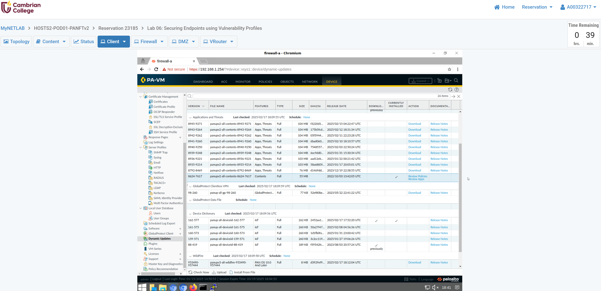
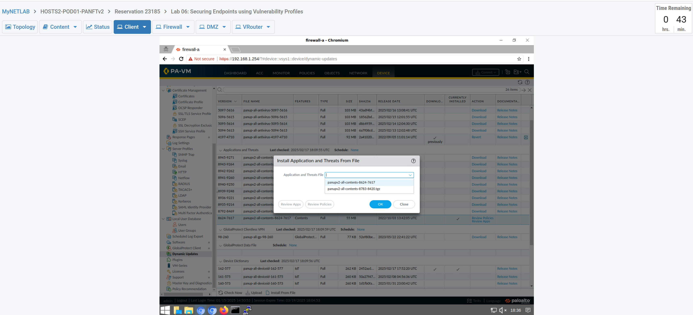
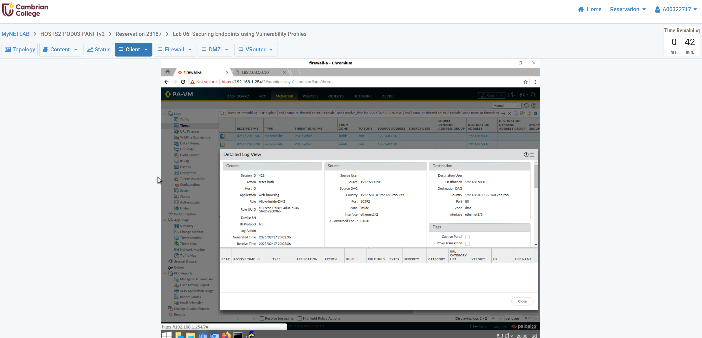
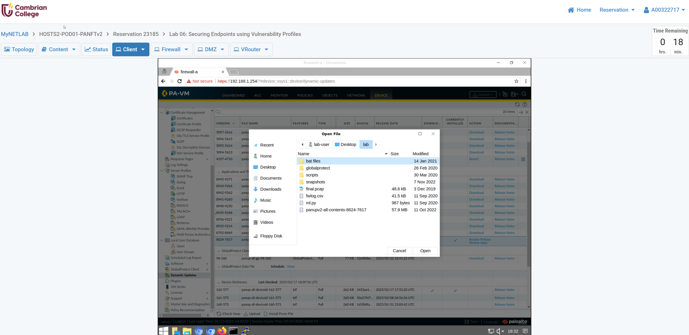
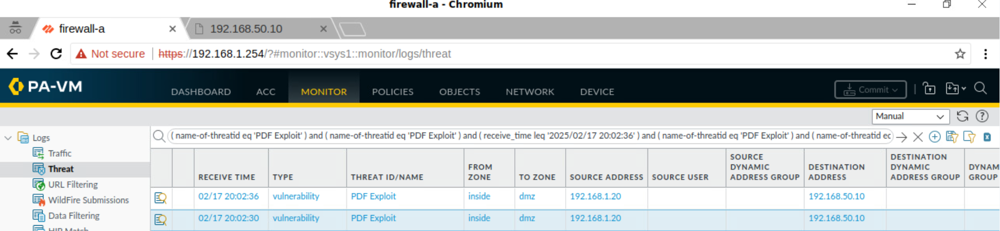
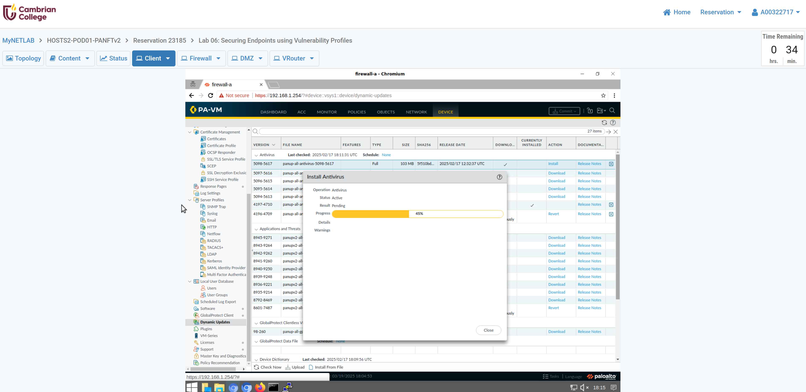
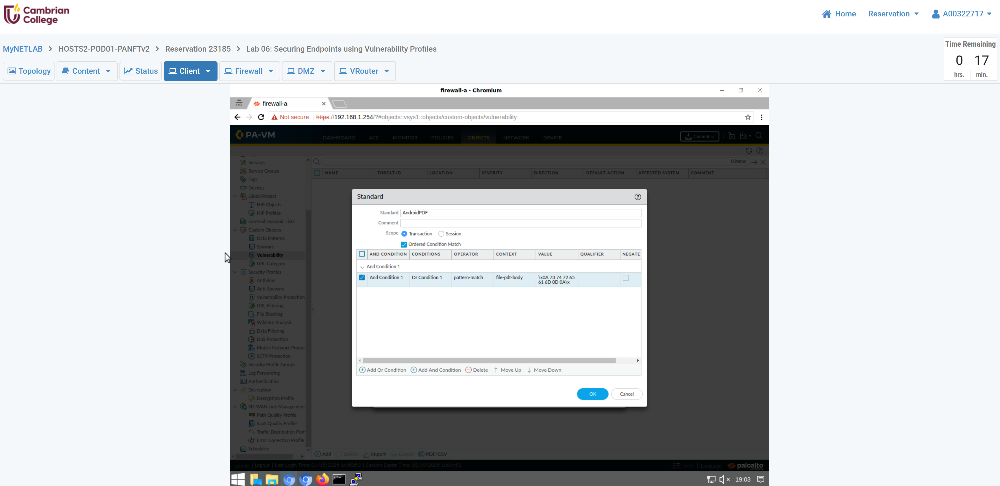
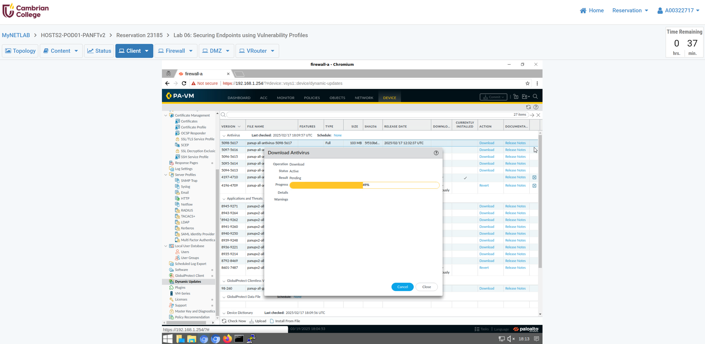
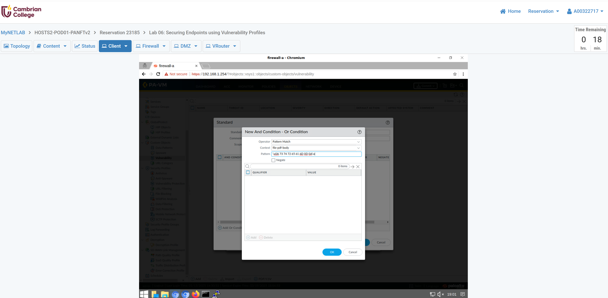

**[Student ID] Ross Moravec Lab 6: Securing Endpoints using Vulnerability Profiles**

**1.1 Download and Install the Latest Dynamic Updates of Antivirus -- Step 2**

**1.2 Install Manual Update of Applications and Threats -- Step 12**

Only the file **"panupv2-all-contents-8624-7617"** is available for download, though the instructions mention "panupv2-all-contents-8786-8435". I proceed with the only file available.

Only the file **"panupv2-all-contents-8624-7617"** was available for installation, though the instructions mention "panupv2-all-contents-8786-8435". I proceed with the only file available.

The file **"panupv2-all-contents-8624-7617"** with a checkmark in the column "Currently Installed". The instructions mention "panupv2-all-contents-8786-8435" but no such file was available for download and installation.

**1.3 Create a Custom Vulnerability Signature -- Step 5**

**1.6 Commit and Test Vulnerability Protection -- Step 9**

