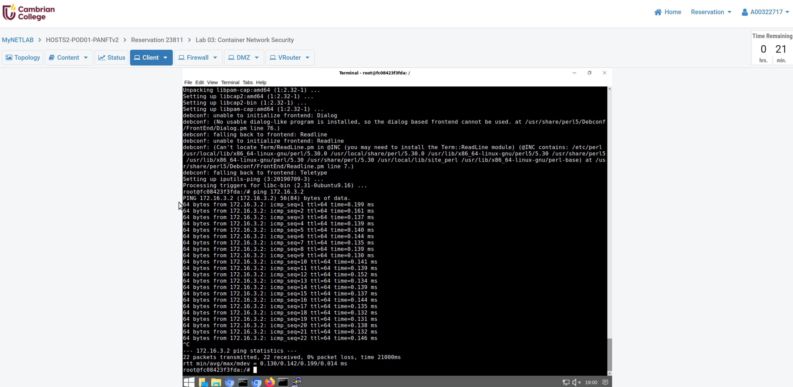
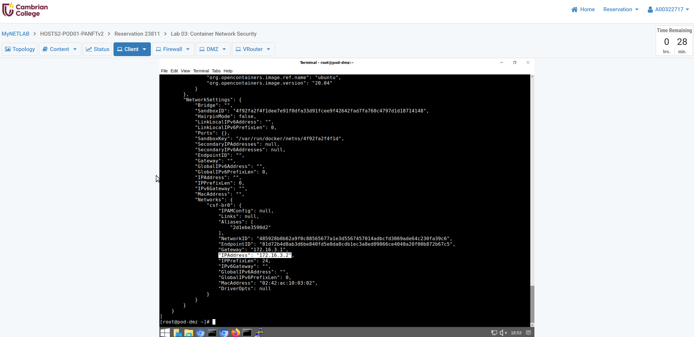
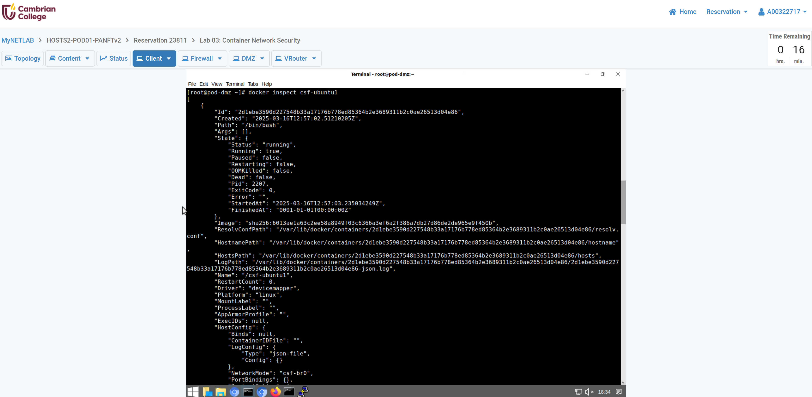
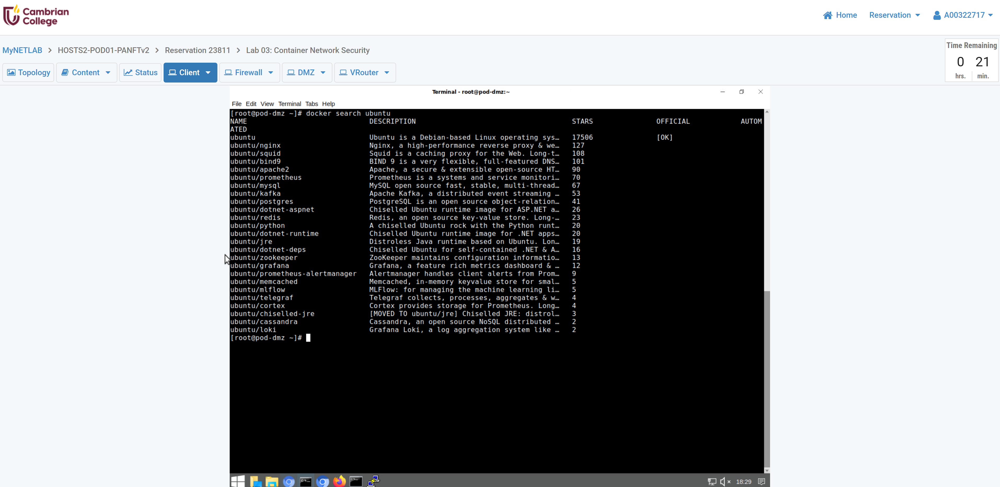
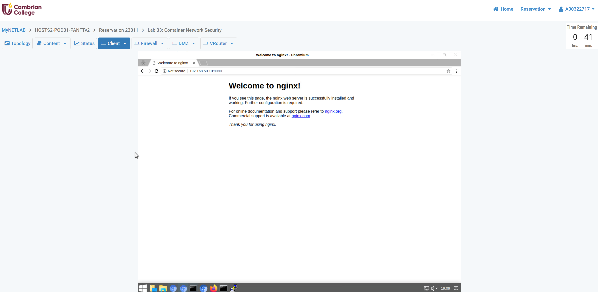
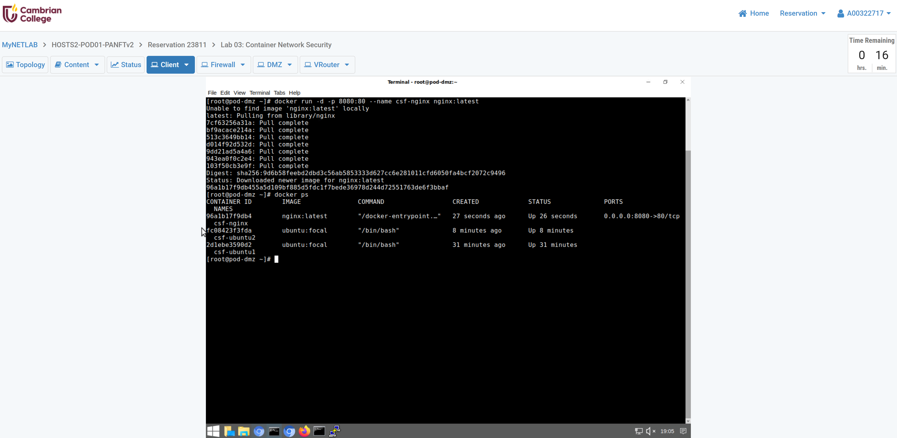

**[Student ID] Ross Moravec Lab 3 Container Network and Security**

**1.2 Pull a Container Image and Run a Docker Container**

- **Step 3 (Page 16)** "In the Terminal window, display the ubuntu container images..."

- **Step 8 (Page 17)** "View the details of the running container in JSON format..."

- **Step 8 (Page 17)** "Record the IP Address of 172.16.3.2..."

- **Step 14 (Page 19)** "Ping the newly created container..."

**1.3 Map the Host Port to the Running Web Container and Access the Container using the Web Browser**

- **Step 4 (Page 22)** "View your newly created nginx container by typing the command..."

- **Step 12 (Page 24)** "Access the nginx container's default web page by typing http://192.168.50.10:8080

