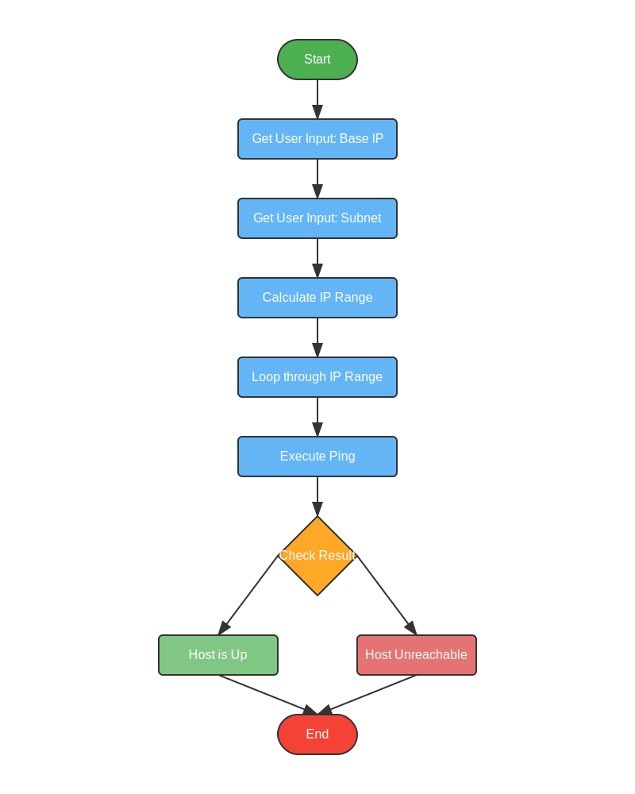

# Async Rust Ping-Sweep CLI

An asynchronous ICMP ping-sweep network-discovery tool written in **Rust**, using the **Tokio** runtime for concurrent operations and **MPSC channels** for thread-safe result communication.

## Origin

Built as an **independent extension** to the Week 2 lab of CSC-7308 (SysOps and Cloud Security) on Palo Alto Networks' Application Command Center. The lab explored network visibility and application traffic analytics; this tool complements it by providing a ground-truth host-discovery primitive against which ACC observations can be correlated.

## What It Does

Given a base IPv4 address and a CIDR subnet mask, the tool:

1. Prompts the user for `base_ip` and `subnet_mask` via stdin.
2. Computes the host-address range within the subnet.
3. Spawns concurrent Tokio tasks, one per candidate host.
4. Each task issues an ICMP echo request and awaits the response via a blocking thread.
5. Reports each host as **up** or **unreachable** as responses arrive.

### Example Run

```text
Enter base IP (e.g., 192.168.1.0): 192.168.1.0
Enter subnet mask (e.g., 24 for /24): 24
Host 192.168.1.1 is up.
Host 192.168.1.2 is unreachable.
Host 192.168.1.10 is up.
...
```

## Design

### Architecture

The program combines **async I/O** (Tokio) with **blocking-thread isolation** for the synchronous `pinger` crate:

```text
Main (async)
 └── for each host IP:
      └── tokio::task::spawn_blocking
           └── std::thread::spawn
                ├── pinger::ping()          (blocking ICMP)
                └── mpsc::channel send      (bool result)
```

Why this layering? The `pinger` crate uses OS-level raw sockets (blocking). Running it inside Tokio's executor thread pool would stall the runtime. `spawn_blocking` moves the work to a dedicated blocking thread pool; `std::thread::spawn` inside that gives an additional layer of isolation for the ICMP call itself.

### Key Technical Concepts

1. **Asynchronous Programming** — Tokio manages the concurrent host iteration without OS-thread explosion.
2. **Thread Safety** — MPSC channels coordinate result delivery between the blocking ping thread and the async handler.
3. **Network Programming** — IPv4 octet manipulation, subnet arithmetic (`2^(32-mask) - 1` host count).
4. **Memory Safety** — Rust's ownership system enforces safe data sharing across thread boundaries.

See [`code-explanation.md`](code-explanation.md) for a detailed line-by-line walkthrough.

## Control Flow



Mermaid source: [`ping-sweep-flow.mermaid`](ping-sweep-flow.mermaid)

## Dependencies

```toml
[dependencies]
pinger = "1"
tokio = { version = "1", features = ["full"] }
```

## Build & Run

```bash
cargo new ping_sweep
cd ping_sweep
# Add dependencies to Cargo.toml
# Place the main.rs implementation (reconstructible from code-explanation.md)
cargo build --release
cargo run --release
```

## Safety & Ethics

ICMP echo-request scanning is a **reconnaissance primitive**. Use this tool only on networks you own or are explicitly authorized to scan. Unauthorized network scanning may violate computer-misuse laws and policies.

## Relevance to the Course

The tool connects Week 2's material directly:

- **Reconnaissance awareness** (Week 3) — This is exactly the kind of traffic a NGFW should detect via zone-protection profiles.
- **ACC visibility** (Week 2) — The traffic this tool generates is what ACC dashboards surface as application: `ping` or protocol: `ICMP`.
- **Threat intelligence** (Week 5) — Sweeping subnets is often a precursor in multi-stage attacks tracked by AutoFocus.

## License

© Ross Moravec. Released under the repository [MIT License](../../../../../LICENSE).
