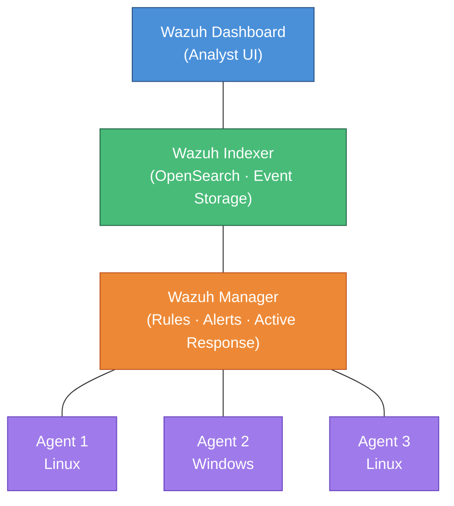

# Week 04 — Build a SOC (Group Capstone)

## Session Info

| | |
|---|---|
| **Date** | 2025-01-28 |
| **Duration** | 2-part lecture (~3+ hours total) |
| **Format** | Group Assignment — "Open-Source SOC 2025" |
| **Deliverable** | Multi-part team project; individual Part 1 (Cyber Kill Chain) |

## Topics Covered

- Security Operations Center (SOC) fundamentals: people, process, technology
- SIEM architecture: log collection → normalization → correlation → alerting → response
- **Wazuh** open-source SIEM: manager, indexer (OpenSearch), dashboard, agents
- Log sources and event normalization
- Detection rule engineering and tuning
- **Cyber Kill Chain** (Lockheed Martin, 2011) — seven-stage attack framework
- Mapping attacker tactics to defender controls at each stage

## Tools & Platforms

- **Wazuh** SIEM (open-source; fork of OSSEC with ELK/OpenSearch integration)
- **Cyber Kill Chain** framework (Lockheed Martin)
- Course reference materials: *Wazuh Project.pdf* (3.4 MB), *Wazuh Lab Documentation.docx* (6.3 MB), *Open-Source SOC 2025.docx* (assignment spec)

## Key Concepts

### Cyber Kill Chain — Seven Stages

| # | Stage | Attacker Action | Defender Opportunity |
|---:|---|---|---|
| 1 | **Reconnaissance** | Info gathering | Zone protection, threat intel |
| 2 | **Weaponization** | Couple malware + exploit | (limited visibility) |
| 3 | **Delivery** | Transmit payload | Email gateway, URL filter, file blocking |
| 4 | **Exploitation** | Trigger vulnerability | Endpoint protection, patch posture |
| 5 | **Installation** | Establish persistence | FIM, process monitoring, HIDS |
| 6 | **Command & Control** | Remote attacker comms | DNS security, egress monitoring |
| 7 | **Actions on Objectives** | Exfiltrate / impact | DLP, anomaly detection, segmentation |

### Wazuh Architecture



### Why Open-Source SIEM?

- **Cost** — no per-GB or per-EPS licensing
- **Customization** — full rule-language access, custom decoders
- **Educational value** — complete visibility into every layer
- **Integration** — Filebeat, Syslog, Elastic stack compatibility

### Sample Wazuh Detection Rules (Open-Source)

The following are examples from the [public Wazuh ruleset](https://github.com/wazuh/wazuh-ruleset) that map to Cyber Kill Chain stages:

```xml
<!-- Kill Chain Stage 1: Reconnaissance — SSH brute-force detection -->
<rule id="5710" level="5">
  <if_matched_sid>5711</if_matched_sid>
  <match>Failed password</match>
  <description>sshd: Multiple failed authentication attempts</description>
  <group>authentication_failed,</group>
</rule>

<!-- Kill Chain Stage 5: Installation — File integrity change detected -->
<rule id="550" level="7">
  <category>ossec</category>
  <decoded_as>syscheck_integrity_changed</decoded_as>
  <description>Integrity checksum changed</description>
  <group>syscheck,</group>
</rule>

<!-- Kill Chain Stage 6: C2 — Anomalous outbound connection pattern -->
<rule id="86601" level="12">
  <if_sid>86600</if_sid>
  <match>Suricata: Alert</match>
  <description>IDS event: Possible C2 communication detected</description>
  <group>ids,</group>
</rule>
```

### SOC = People + Process + Technology

A working SOC is **not a product**. It is:

- **People** — analysts who triage alerts, write runbooks, tune rules
- **Process** — escalation, containment, eradication, recovery playbooks
- **Technology** — SIEM, EDR, SOAR, ticketing

Missing any one of these, a SOC produces noise.

## Lab / Project Deliverable

**Group Project Deliverables** (team-scoped):
1. Wazuh Manager + agent deployment
2. SOC architecture diagram and write-up
3. Custom detection rule set (SSH brute-force, FIM, rootkit, privilege escalation)
4. Incident response runbooks
5. Cyber Kill Chain mapping table
6. Written technical report

**Individual Contribution (Part 1):** Cyber Kill Chain analysis mapping each of the seven stages to:
- Attacker techniques
- Wazuh detection capabilities
- Defender response actions

Full write-up: [`../MIDTERM_PROJECT_SUMMARY.md`](../MIDTERM_PROJECT_SUMMARY.md).

### Methodology
1. Analyzed the Cyber Kill Chain framework (Lockheed Martin, 2011) — seven sequential attack stages
2. For each stage, identified representative attacker techniques from course material and MITRE ATT&CK
3. Mapped each technique to specific Wazuh detection capabilities (rule IDs, log types, active response)
4. Documented defender response actions for each stage (alert, block, tune, investigate)
5. Produced a structured mapping table connecting the full chain from reconnaissance through actions on objectives

## Reflection

> **💡 Key Takeaway:** A security program should be audited by which kill-chain stages it can detect, not by which products it owns.

This week was the pivot point of the course. All prior weeks were about **one tool** (Palo Alto NGFW); this week was about **orchestrating many tools and humans** under a framework.

Building the Cyber Kill Chain mapping forced me to confront a gap: I knew attacker techniques (from reading), and I knew defender tools (from labs), but I had never written out the **correspondence** between them. Doing so changed how I think about security architecture — not "what tools do we have?" but "which stages can we see?"

The Wazuh-vs-commercial decision is also clarifying. Commercial SIEMs (Splunk, QRadar, Sentinel) have deeper integrations and better dashboards, but Wazuh is **genuinely viable** for SMB, education, and homelab environments. Every organization of my size should at least prototype with Wazuh before committing to six-figure licensing.

## Connections

- **Week 5** — Threat intelligence (AutoFocus) feeds IoCs into SIEM correlation.
- **Week 6** — Endpoint security telemetry ingests into Wazuh.
- **Week 7** — Cloud workloads also emit logs that Wazuh agents can collect.
- **CSC-7310 Forensics** — Post-incident evidence often starts from SIEM alerts.
- **CSC-7312 Malware Analysis** — What Wazuh rules catch; what WildFire classifies.

## Team & Attribution

- **Team size:** 4+ students
- **My contribution:** Part 1 — Cyber Kill Chain mapping
- **Other team members:** Not named per privacy policy

## References

- Lockheed Martin, *Intelligence-Driven Computer Network Defense* (the Cyber Kill Chain paper)
- [Wazuh documentation](https://documentation.wazuh.com/) (Wazuh Inc. — referenced only)
- MITRE ATT&CK framework (complementary to Cyber Kill Chain)
- Course materials: Wazuh Project.pdf, Wazuh Lab Documentation.docx, Open-Source SOC 2025.docx (course materials — not redistributed)
