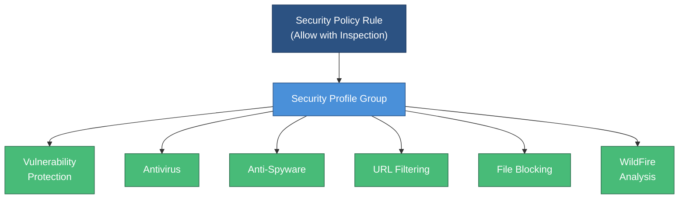

# Week 06 — Endpoint Security & Vulnerability Profiles

## Session Info

| | |
|---|---|
| **Date** | 2025-02-11 |
| **Duration** | 2-part lecture (~2+ hours total) |
| **Lab** | Palo Alto Networks SOFv2 Lab 06 — Securing Endpoints using Vulnerability Profiles |
| **Deliverable** | Individual lab report submission |

## Topics Covered

- Endpoint security in a defense-in-depth architecture
- **Vulnerability Protection profiles** — signature-based exploit blocking
- **Antivirus profiles** — traditional AV signature matching at the gateway
- **Anti-Spyware profiles** — C2 callback and spyware traffic detection
- **WildFire Analysis profiles** — file submission to cloud sandbox
- Security profile **groups** and **profile application** to policy rules
- Process hierarchy, IOC extraction, and analyst workflows for endpoint investigations

## Tools & Platforms

- **Palo Alto Networks NGFW** — profile configuration
- **Security policy rules** — applying profiles to allowed traffic
- **Threat database** — vendor-published signature updates

## Key Concepts

### Profiles vs. Rules

A **rule** decides allow/deny. A **profile** decides *how much inspection* to do on allowed traffic. Every allow rule should carry a **profile group** (vulnerability + antivirus + anti-spyware + URL filtering + file blocking + WildFire analysis).



### Vulnerability Protection Profile

Signature-based detection of exploit attempts:

| Severity | Default Action |
|---|---|
| Critical | Block |
| High | Block |
| Medium | Alert |
| Low | Default |
| Informational | Default |

Tuning: you rarely change Critical/High; you tune Medium and Low based on your environment.

### Defense-in-Depth at the Endpoint

The firewall sees ingress/egress traffic; it cannot see:
- Local process execution
- File system changes
- Registry modifications
- In-memory exploitation

That is why endpoint security (Cortex XDR, Defender, CrowdStrike) exists **as a complement** to NGFW, not a replacement. A complete posture needs both.

### Security Profile Group Configuration (Sanitized)

A representative profile group combining multiple protection layers on a single allow-rule:

```xml
<!-- Palo Alto NGFW Security Profile Group — generalized example -->
<entry name="Standard-Protection">
  <virus><member>Antivirus-Default</member></virus>
  <spyware><member>Anti-Spyware-Strict</member></spyware>
  <vulnerability><member>Vuln-Protection-Strict</member></vulnerability>
  <url-filtering><member>URL-Filter-Corporate</member></url-filtering>
  <file-blocking><member>Block-Executables</member></file-blocking>
  <wildfire-analysis><member>WildFire-Default</member></wildfire-analysis>
</entry>
```

> Every security policy allow-rule should reference a profile group. Rules without profiles pass traffic uninspected — they are trust-only controls.

### Process Hierarchy in Endpoint Investigation

Modern endpoint tools surface **process trees** (parent → child → grandchild). This is essential because:

- Malware often spawns from benign parents (Word → cmd.exe → powershell.exe is a classic indicator)
- Analysts need to trace the full chain, not just the final process
- IOCs extracted at any node in the tree pivot to other endpoints

## Lab Deliverable

- Report submitted as DOCX — includes screenshots of vulnerability profile configuration, anti-spyware profile setup, and how profiles are attached to security policy rules.
- Sanitized PDF to be added to [`../assignments/`](../assignments/).

### Methodology
1. Created a Vulnerability Protection profile with severity-based actions (block critical/high, alert medium)
2. Configured Antivirus and Anti-Spyware profiles for gateway-level malware detection
3. Set up a WildFire Analysis profile for cloud sandbox submission of unknown files
4. Assembled a Security Profile Group combining all four profile types
5. Attached the profile group to an existing allow-rule in the security policy and committed the configuration

## Reflection

> **💡 Key Takeaway:** Every firewall allow-rule without a security profile group attached is a trust-only control — the weakest link in an NGFW configuration.

This week crystallized the **layered defense** model. Vulnerability profiles close the gap between "I have a firewall rule that allows web traffic" and "I want to block exploits hidden inside that allowed web traffic."

The signature-driven model has a well-known weakness: novel exploits evade signatures until the vendor publishes them. That gap is why Week 5's threat intelligence and Week 8's upcoming internet threat prevention matter — they widen the net beyond static signatures.

Personal takeaway: **every security policy rule should have a profile group attached by default**. Rules without profiles are trust-only controls — they are the weakest link in a NGFW configuration.

## Evidence

- **Lab Submission:** [Lab 06 — Securing Endpoints with Vulnerability Profiles](../assignments/Wk06_Lab_06_Endpoint_Security.md)
- **Screenshots:** [9 images](../screenshots/) — `wk06_endpoint_1.png` through `wk06_endpoint_9.png`

## Connections

- **Week 4** — Wazuh agents provide the endpoint-side telemetry that complements NGFW profile observations.
- **Week 5** — AutoFocus tags feed the same signature streams that profiles consume.
- **Week 8** — Profile-based prevention extends into URL filtering and DNS security.
- **CSC-7312 Malware Analysis** — The analysts creating these signatures work here.

## References

- Palo Alto Networks "Security Profiles" administrator documentation (vendor site)
- NIST SP 800-83 (Malware Incident Prevention and Handling)
- Course Lab PDF: `Securing Endpoints using Vulnerability Profiles.pdf` (vendor copyright — not redistributed)
- Course lecture transcript part 2 (local, Week 6)
