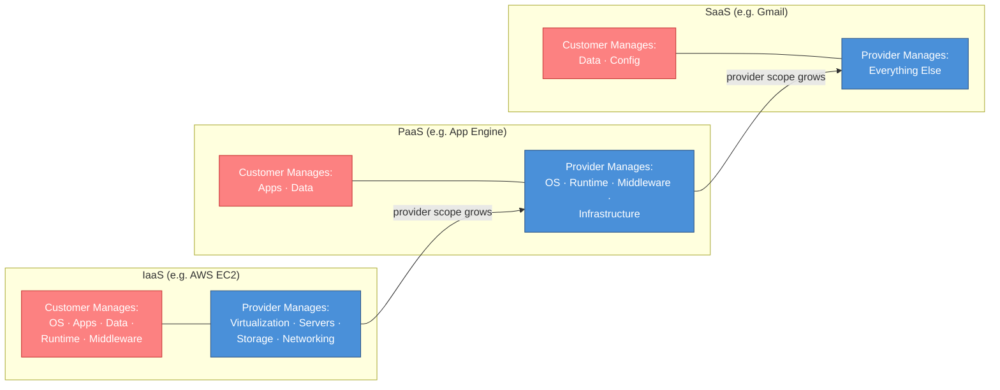

# Week 07 — Cloud Computing & Container Fundamentals

## Session Info

| | |
|---|---|
| **Date** | 2025-02-18 |
| **Duration** | ~1.6 hours lecture |
| **Lab** | (lecture-only — no hands-on lab this week) |
| **Deliverable** | Participation; concepts reinforced in Weeks 8–9 |

## Topics Covered

- Cloud computing definition, characteristics, and economic drivers
- **Service models:** IaaS, PaaS, SaaS
- **Deployment models:** public, private, community, hybrid
- Major cloud providers: **AWS**, **Microsoft Azure**, **GCP**, **Apple Cloud**
- **Shared Responsibility Model** — the single most important cloud security concept
- **Microsoft Defender for Cloud / for Containers** configuration overview
- **Microsoft Entra ID** (formerly Azure AD) for cloud identity & access management
- Container technology basics (Docker, Kubernetes) — foundation for Weeks 8–9

## Tools & Platforms (Conceptual)

- AWS, Azure, GCP, Apple Cloud
- Microsoft Defender for Cloud
- Microsoft Entra ID (Azure AD)
- Docker, Kubernetes

## Key Concepts

### Service Model Comparison

| Model | You Manage | Provider Manages | Example |
|---|---|---|---|
| **IaaS** | OS, apps, data, runtime, middleware | Virtualization, servers, storage, networking | AWS EC2, Azure VMs |
| **PaaS** | Apps, data | OS, runtime, middleware, infrastructure | App Engine, Heroku |
| **SaaS** | Only data/config | Everything else | Gmail, YouTube, Salesforce |

### The Shared Responsibility Model (SRM)

Every cloud security conversation starts here:

- **Security OF the cloud** = provider's responsibility (physical DCs, hypervisor, hardware)
- **Security IN the cloud** = customer's responsibility (workloads, data, access, configuration)

The boundary **moves left** (more customer responsibility) as you move from SaaS → PaaS → IaaS.

**Common failure mode:** customers assume the provider is handling something they aren't. Examples:
- "My S3 bucket is secure because AWS is secure" → misconfigured bucket policies remain the customer's responsibility.
- "My Kubernetes cluster is managed, so security is taken care of" → workload security (pod policies, RBAC, secrets) is still yours.

### Deployment Models

- **Private** — dedicated to one org; full control, higher cost
- **Public** — multi-tenant, on-demand, consumption pricing (AWS, Azure, GCP)
- **Community** — shared among organizations with common concerns (e.g., government)
- **Hybrid** — public + private connected with controlled data movement

### Microsoft Defender for Containers (preview)

Introduced as a lead-in to Weeks 8–9. Key capabilities:

- Image scanning (CI/CD integrated and registry)
- Runtime detection (anomalous container behavior)
- Kubernetes policy enforcement
- Compliance reporting

### Microsoft Entra ID

The identity plane for Azure, Office 365, and third-party apps. Critical concepts introduced:

- **Users, groups, roles**
- **Conditional Access** — contextual policy enforcement (location, device, risk)
- **Managed identities** — service-to-service auth without credentials

## Lab / Deliverable

No formal lab this week. Lecture was conceptual groundwork for Weeks 8–9's hands-on container security work.

## Reflection

> **💡 Key Takeaway:** The shared responsibility model is the single most important concept in cloud security — misunderstanding the boundary is the root cause of most cloud breaches.

This was the **thinking** week of the course. No lab, no submission, just reorientation: after six weeks of Palo Alto NGFW operations, we stepped back to the cloud-native world where NGFWs are one control among many, sometimes replaced by cloud-native equivalents (AWS Security Groups, Azure NSGs, GCP Firewall Rules).

The shared responsibility model is the most important idea in the course. Every cloud security failure I have read about post-hoc traces back to a misunderstanding of where the provider's responsibility ends and the customer's begins. The S3 misconfigurations that leaked customer data from multiple Fortune 500 companies — all SRM failures.

This content is foundational for everything that follows and is among the most interview-relevant topics in the entire course.

## Connections

- **Week 8** — Internet threat prevention in a cloud context.
- **Week 9** — Container networking and security (hands-on depth on this week's concepts).
- **CSC-7303 Network Defense** — Cloud-native firewalls complement on-prem designs.
- **CSC-7307 Cybersecurity Capstone** — Cloud security is likely capstone scope.

## References

- NIST SP 800-145 (The NIST Definition of Cloud Computing)
- CSA Cloud Controls Matrix (CCM)
- Microsoft Entra ID documentation (vendor site)
- Course lecture transcript (local, Week 7)
