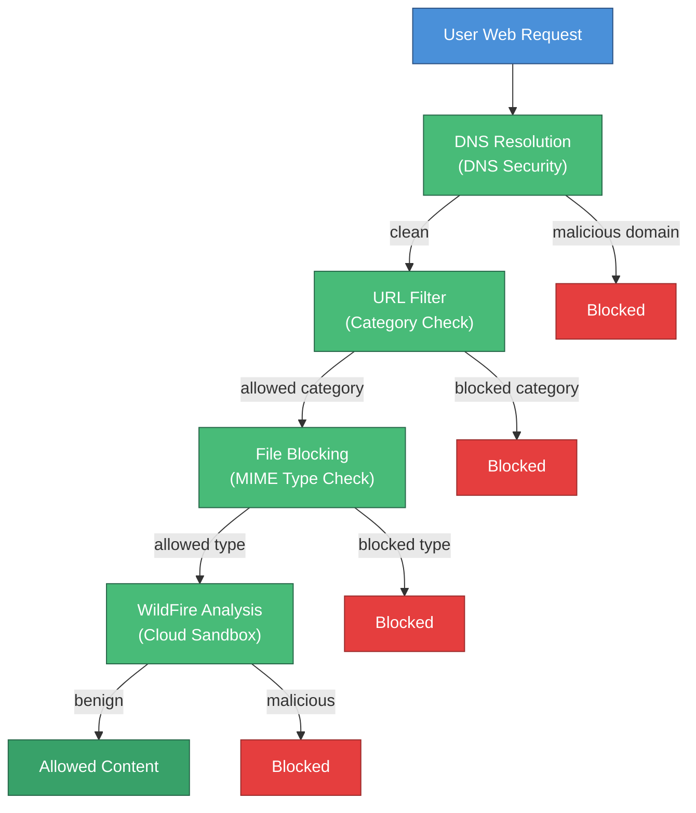

# Week 08 — Internet Threat Prevention

## Session Info

| | |
|---|---|
| **Date** | 2025-03-03 |
| **Duration** | ~1.3 hours lecture + lab time |
| **Lab** | Palo Alto Networks CSFv2 Lab 02 — Preventing Internet Threats |
| **Deliverable** | Individual lab report submission |

## Topics Covered

- Internet threat landscape in a cloud-first enterprise
- **URL filtering** — category-based web access control
- **DNS security** — blocking at name-resolution time
- **File blocking profiles** — MIME/type-based content control
- **WildFire analysis** — cloud sandbox for unknown binaries
- Threat prevention in **cloud-first** architectures (CSFv2 framework)
- Integration of threat-prevention profiles with security policy rules in a cloud context

## Tools & Platforms

- **Palo Alto Networks NGFW** (cloud-first configuration per CSFv2)
- **URL filtering** profiles and PAN-DB categories
- **DNS Security** cloud service
- **File blocking** profiles

## Key Concepts

### URL Filtering as a Primary Control

URL filtering is often under-appreciated. Most enterprise attacks involve:

- A user clicking a phishing link → URL filter can block at category ("newly-registered-domain", "phishing")
- A C2 beacon to an attacker-controlled domain → URL filter or DNS security can sever the channel
- A drive-by download → URL filter + file blocking + WildFire catch it

A well-tuned URL filter prevents a significant fraction of endpoint compromises.

### DNS Security at the Name-Resolution Layer

DNS security blocks **before** the HTTP request is even made. Benefits:

1. **Protocol-agnostic** — catches HTTP, HTTPS, other TCP/UDP, even custom C2 protocols
2. **Performance** — DNS blocking is cheaper than inline inspection
3. **Coverage** — sees every name resolution, not just inspected web traffic

### File Blocking Profiles

File blocking is MIME/type-based:

- Block `.exe`, `.scr`, `.hta`, etc. downloads by default
- Allow with prompt for approved categories
- Quarantine unknown types for WildFire analysis

### CSFv2 vs. SOFv2

This week shifts from the **SOFv2** (Security Operating Fundamentals v2) lab track to the **CSFv2** (Cloud Security Fundamentals v2) track. The concepts are similar, but CSFv2 labs situate everything in cloud-deployed NGFW context.

## Lab Deliverable

- Report submitted as DOCX — includes screenshots of URL filtering profile configuration, DNS security settings, and file blocking action tables.
- Sanitized PDF to be added to [`../assignments/`](../assignments/).

### Methodology
1. Configured a URL Filtering profile with category-based allow/block/alert actions using PAN-DB categories
2. Enabled DNS Security cloud service for domain-level threat blocking at name resolution
3. Created a File Blocking profile with MIME-type rules (block executables, alert on archives)
4. Integrated all profiles into a security policy rule within the CSFv2 cloud-deployed NGFW context
5. Tested filtering by generating controlled traffic to known test URLs and verifying block/alert actions

## Reflection

> **💡 Key Takeaway:** Good policy minimizes expensive deep inspection by cutting threats at the cheapest layers first — DNS blocking before URL filtering before file analysis.

This week tied together the threads of Weeks 5 (threat intelligence) and Week 6 (endpoint protection): URL filtering, DNS security, and file blocking are **intel-driven prevention** layers that operate on different abstractions (domains, names, file types) but share the same intelligence source.

A practical insight: defense layering has a **cost gradient**. Blocking at DNS is cheapest; blocking at URL filter is moderate; inspecting file content and submitting to WildFire is expensive. Good policy minimizes expensive inspection by cutting threats at the cheap layers first.

## Connections

- **Week 5** — URL filter, DNS security, and file blocking all consume intelligence sourced from AutoFocus/WildFire.
- **Week 6** — File blocking profiles are part of the same profile-group pattern as vulnerability profiles.
- **Week 7** — Applied in cloud-first architectures per the CSFv2 framework.
- **Week 9** — Continues the cloud security track with container-specific controls.

## References

- Palo Alto Networks URL Filtering documentation (vendor site)
- Palo Alto Networks DNS Security documentation (vendor site)
- Course Lab PDF: `PAN_CSFv2_Lab_02.pdf` (vendor copyright — not redistributed)
