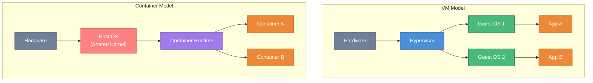
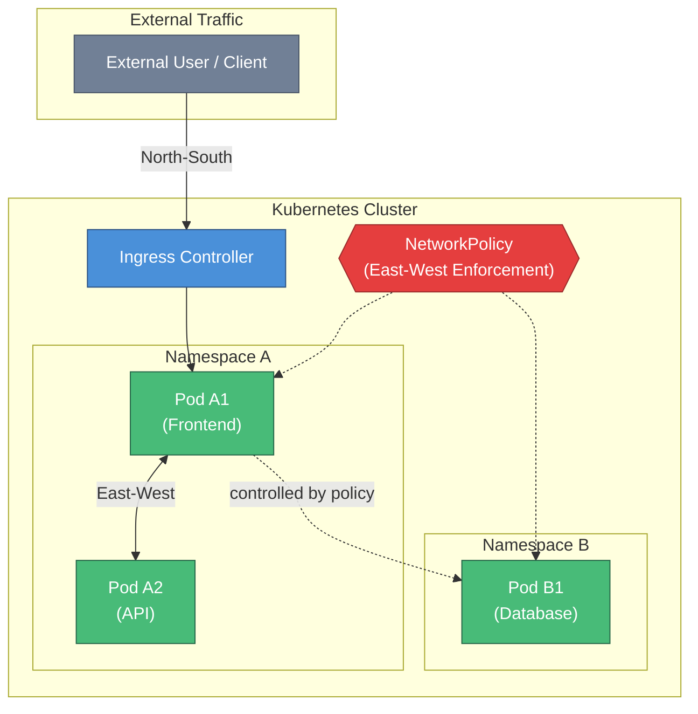

# Week 09 — Container Networking & Security

## Session Info

| | |
|---|---|
| **Date** | 2025-03-10 |
| **Duration** | Lab-focused (no captured video at portfolio snapshot) |
| **Lab** | Palo Alto Networks CSFv2 Lab 03 — Container Networking and Security |
| **Deliverable** | Individual lab report submission |

## Topics Covered

- Container security fundamentals: isolation, namespaces, cgroups
- **Docker networking models** — bridge, host, overlay, macvlan
- **Kubernetes networking** — pods, services, network policies, CNI plugins
- **East-west traffic security** (between pods) vs. **north-south** (ingress/egress)
- Container image scanning and supply-chain security
- **Pod security standards** — privileged, baseline, restricted
- Secrets management in container orchestrators
- Palo Alto Networks container-aware security (CN-Series, Prisma Cloud)

## Tools & Platforms

- **Docker** — container runtime
- **Kubernetes** — orchestration
- **Palo Alto Networks CN-Series / Prisma Cloud** (reference) — container-aware NGFW
- **Network policies** (Kubernetes NetworkPolicy resources)

## Key Concepts

### Container vs. VM Isolation

Containers share the **host kernel** and rely on namespaces + cgroups for isolation. This is a weaker security boundary than a VM's hypervisor boundary. The implication: container escape vulnerabilities are more consequential than VM escape in most architectures.

### Kubernetes Pod Security Standards

Three profiles defined by the Kubernetes project:

| Profile | Posture | Allowed |
|---|---|---|
| **Privileged** | Unrestricted | Everything (not for production) |
| **Baseline** | Minimal restrictions | No privilege escalation, hostPath mounts, etc. |
| **Restricted** | Heavily restricted | Enforce principle of least privilege |

Modern deployments start at **Baseline** and move to **Restricted** workload-by-workload.

### East-West vs. North-South Traffic

- **North-South** — traffic entering/leaving the cluster (user ↔ service)
- **East-West** — traffic between workloads inside the cluster (service ↔ service)

Traditional perimeter firewalls only see north-south. **Kubernetes NetworkPolicies** or service mesh (Istio, Linkerd) are required for east-west segmentation. Without them, one compromised pod can pivot laterally.

### Container Image Supply Chain

Images are the **binaries of container-native apps**. Supply-chain controls:

1. **Signed images** (cosign, sigstore)
2. **Vulnerability scanning** at build, push, and runtime
3. **Admission controllers** that block unsigned or vulnerable images from deploying
4. **SBOM** (Software Bill of Materials) for every image

### Secrets in Containers

Do **not** bake secrets into images. Patterns:

- Kubernetes **Secrets** (base64-encoded; not encrypted at rest by default)
- **External secrets** (HashiCorp Vault, AWS Secrets Manager, Azure Key Vault) with sidecar injection
- **Managed identities** where available

## Lab Deliverable

- Report submitted as DOCX — includes screenshots of container-networking configuration and security policy.
- Sanitized PDF to be added to [`../assignments/`](../assignments/).

### Methodology
1. Explored Docker networking models (bridge, host, overlay) and their security implications
2. Configured Kubernetes NetworkPolicy resources to enforce east-west pod-to-pod segmentation
3. Examined Pod Security Standards (privileged, baseline, restricted) and their enforcement mechanisms
4. Reviewed container image supply-chain controls — scanning, signing, admission controllers
5. Documented how Palo Alto CN-Series and Prisma Cloud extend NGFW concepts into container-native environments

## Reflection

> **💡 Key Takeaway:** Containers share the host kernel, making east-west segmentation via Kubernetes NetworkPolicies essential — a cluster-external firewall cannot see pod-to-pod traffic.

Container security requires a new mental model. The **host perimeter** model assumes machines are atomic units; containers break that assumption. A Kubernetes cluster has its own internal topology — its own pods, services, policies, DNS — that a cluster-external firewall cannot see.

This week completed the **breadth arc** of the course: from perimeter NGFW (Weeks 1–3) to SIEM (Week 4) to intelligence (Week 5) to endpoint (Week 6) to cloud (Week 7) to cloud-native threat prevention (Week 8) to containers (Week 9). Nine weeks, the full stack of operational defense.

A gap the course did not close: **service mesh** (Istio, Linkerd) is the modern answer to east-west segmentation in Kubernetes, and it barely surfaced. For real-world container security, that would be the next study topic.

## Evidence

- **Lab Submission:** [Lab 03 — Container Networking and Security](../assignments/Wk09_Lab_03_Container_Security.md)
- **Screenshots:** [6 images](../screenshots/) — `wk09_container_1.png` through `wk09_container_6.png`

## Connections

- **Week 7** — Cloud concepts underpinning containers.
- **Week 8** — Cloud-first threat prevention applied to container workloads.
- **Week 4** — Wazuh agents can run in Kubernetes via DaemonSets to ingest container telemetry.
- **CSC-7307 Cybersecurity Capstone** — Container and cloud are likely capstone domains.

## References

- Kubernetes Pod Security Standards documentation
- CIS Kubernetes Benchmark
- NIST SP 800-190 (Application Container Security Guide)
- Palo Alto Networks CN-Series and Prisma Cloud documentation (vendor site)
- Course Lab PDF: `PAN_CSFv2_Lab_03.pdf` (vendor copyright — not redistributed)
