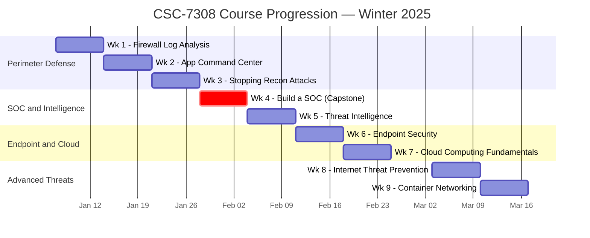

# SysOps and Cloud Security — CSC-7308 — Winter 2025

<!-- CI badges — will activate once published to GitHub -->
<!--  -->
<!--  -->
<!--  -->
<!--  -->


> Public, employer-facing course portfolio for **SysOps and Cloud Security (CSC-7308)**, a Winter 2025 course in the Cambrian College Postgraduate Cybersecurity Certificate program (Sudbury, Ontario). Instructor: **Aditya Palshikar**.


> ✅ **Course complete (Winter 2025).** All assigned coursework delivered; this portfolio is the final published state.

---

## About the Author

**Ross Moravec** — Postgraduate Cybersecurity student at Cambrian College (Sudbury, Ontario), with a focus on operational defense, SIEM/SOC operations, and cloud security. This portfolio documents hands-on work with Palo Alto Networks NGFW, Wazuh SIEM, and cloud-native security tools completed during the Winter 2025 term.

- 📂 Program: Postgraduate Cybersecurity Certificate (Fall 2024 – Winter 2025)
- 🛡️ Focus: SysOps, cloud security, detection engineering, threat intelligence
- 💻 Independent work: Rust async network tooling, CI/CD automation, documentation-as-code
- 🔗 GitHub: [github.com/rossmoravec](https://github.com/rossmoravec)
- 💼 LinkedIn: [linkedin.com/in/rossmoravec](https://linkedin.com/in/rossmoravec)

---

## Quick Links

- Course Portfolio → [`CC/Winter 2025/SysOps and Cloud Security - Aditya Palshikar - CSC-7308/README.md`](CC/Winter%202025/SysOps%20and%20Cloud%20Security%20-%20Aditya%20Palshikar%20-%20CSC-7308/README.md)
- Weekly Summaries → [`CC/.../weekly/`](CC/Winter%202025/SysOps%20and%20Cloud%20Security%20-%20Aditya%20Palshikar%20-%20CSC-7308/weekly/)
- Build a SOC (Group Project) → [`MIDTERM_PROJECT_SUMMARY.md`](CC/Winter%202025/SysOps%20and%20Cloud%20Security%20-%20Aditya%20Palshikar%20-%20CSC-7308/MIDTERM_PROJECT_SUMMARY.md)
- Scripts & Code → [`SCRIPTS_README.md`](CC/Winter%202025/SysOps%20and%20Cloud%20Security%20-%20Aditya%20Palshikar%20-%20CSC-7308/SCRIPTS_README.md)
- Evidence & Screenshots → [`EVIDENCE_INDEX.md`](CC/Winter%202025/SysOps%20and%20Cloud%20Security%20-%20Aditya%20Palshikar%20-%20CSC-7308/EVIDENCE_INDEX.md)
- Course Reflection → [`COURSE_REFLECTION.md`](CC/Winter%202025/SysOps%20and%20Cloud%20Security%20-%20Aditya%20Palshikar%20-%20CSC-7308/COURSE_REFLECTION.md)
- Project Roadmap → [`ROADMAP.md`](ROADMAP.md)

---

## At a Glance

| | |
|---|---|
| **Course** | SysOps and Cloud Security |
| **Code** | CSC-7308 |
| **Term** | Winter 2025 (January – April) |
| **Instructor** | Aditya Palshikar |
| **Institution** | Cambrian College, Sudbury, Ontario |
| **Program** | Postgraduate Cybersecurity Certificate |
| **Delivery** | Hybrid (synchronous lectures + hands-on labs) |
| **Primary Platforms** | Palo Alto Networks (Strata/Prisma/Cortex), Wazuh SIEM, Microsoft Defender |

---

## For Hiring Managers (5-Minute Tour)

1. **Course Overview** — Read the course README at [`CC/Winter 2025/...`](CC/Winter%202025/SysOps%20and%20Cloud%20Security%20-%20Aditya%20Palshikar%20-%20CSC-7308/README.md) for learning objectives, technologies covered, and outcomes.
2. **Weekly Work** — Browse [`weekly/`](CC/Winter%202025/SysOps%20and%20Cloud%20Security%20-%20Aditya%20Palshikar%20-%20CSC-7308/weekly/) summaries to see week-by-week progression through 9 delivered weeks of content.
3. **Capstone Project** — Review the [`Build a SOC`](CC/Winter%202025/SysOps%20and%20Cloud%20Security%20-%20Aditya%20Palshikar%20-%20CSC-7308/MIDTERM_PROJECT_SUMMARY.md) group project (open-source SIEM with Wazuh).
4. **Original Code** — See the [`ping_sweep/`](CC/Winter%202025/SysOps%20and%20Cloud%20Security%20-%20Aditya%20Palshikar%20-%20CSC-7308/scripts/ping_sweep/) Rust async network scanner built as an independent extension to the Week 2 lab.

## For Technical Reviewers (15-Minute Tour)

- `CC/Winter 2025/.../` — Course portfolio with week-by-week learning evidence.
- `scripts/` — Repository automation (PM loop, portfolio generation, session indexing).
- `docs/` — Skills matrix, references, sessions index, and supporting documentation.
- `.github/workflows/` — CI/CD: link checking, markdown linting, gitleaks secret scanning, PM evidence.
- `portfolio/config.json` — Course metadata driving README automation.

## For Deep Evaluation (30-Minute Tour)

- Trace the **five-phase portfolio automation** in `scripts/portfolio/run.sh` (immediate → short → followup → polish → enhance).
- Read the [code-explanation.md](CC/Winter%202025/SysOps%20and%20Cloud%20Security%20-%20Aditya%20Palshikar%20-%20CSC-7308/scripts/ping_sweep/code-explanation.md) for the Rust async ping sweep: trait bounds, channel semantics, thread safety, and subnet arithmetic.
- Review the Build a SOC writeup: Cyber Kill Chain mapping, Wazuh architecture, SOC operational model.
- Inspect the per-week summaries for technical depth, evidence links, and reflection.

---

## Skills Demonstrated

**Network Security**
- Palo Alto Networks Next-Generation Firewall (NGFW) administration and policy
- Application Command Center (ACC) traffic analytics and correlation
- Firewall log analysis and security policy refinement
- Reconnaissance detection and attack surface reduction

**Cloud Security**
- Cloud service models (IaaS, PaaS, SaaS) and shared responsibility
- Public, private, community, and hybrid deployment models
- Prisma Cloud, CASB, and cloud workload protection
- AWS, Azure, and GCP security posture concepts

**SOC / SIEM Operations**
- Wazuh open-source SIEM architecture and deployment
- Log aggregation, correlation, and alert tuning
- Cyber Kill Chain framework application
- Threat hunting and incident response workflows

**Threat Intelligence**
- Palo Alto AutoFocus threat intelligence platform
- Proactive, prevention-based security posture
- Threat actor profiling and IoC analysis

**Endpoint & Container Security**
- Palo Alto Cortex and vulnerability profile management
- Microsoft Defender for containers and cloud workloads
- Docker and Kubernetes security fundamentals
- Container networking and segmentation

**Software Development for Security**
- Rust asynchronous programming with Tokio runtime
- Thread-safe concurrency with MPSC channels
- Network programming: subnet arithmetic, ICMP, IPv4 manipulation
- CLI tooling and user-input handling

**Professional Tooling**
- Git version control, conventional commits, LFS
- Markdown documentation, Mermaid diagrams, SVG graphics
- CI/CD workflows (GitHub Actions)
- Secret scanning (gitleaks) and link validation

---

## Weekly Topic Map

| Week | Date | Topic | Primary Tool |
|---:|---|---|---|
| 1 | 2025-01-07 | Firewall Log Analysis | Palo Alto NGFW (SOFv2 Lab 03) |
| 2 | 2025-01-14 | Application Command Center + Network Tools | Palo Alto ACC, Rust async scanner |
| 3 | 2025-01-21 | Stopping Reconnaissance Attacks | Palo Alto NGFW (SOFv2 Lab 05) |
| 4 | 2025-01-28 | **Build a SOC (Group Project)** | Wazuh SIEM, Cyber Kill Chain |
| 5 | 2025-02-04 | Threat Intelligence | Palo Alto AutoFocus (SOFv2 Lab 07) |
| 6 | 2025-02-11 | Endpoint Security & Vulnerability Management | Palo Alto vulnerability profiles |
| 7 | 2025-02-18 | Cloud Computing & Container Fundamentals | Microsoft Defender, multi-cloud |
| 8 | 2025-03-03 | Internet Threat Prevention | Palo Alto NGFW (CSFv2 Lab 02) |
| 9 | 2025-03-10 | Container Networking & Security | Palo Alto NGFW (CSFv2 Lab 03) |



Full weekly detail: [`CC/.../weekly/`](CC/Winter%202025/SysOps%20and%20Cloud%20Security%20-%20Aditya%20Palshikar%20-%20CSC-7308/weekly/)

---

## Repository Structure

```text
406-SysOps-Cloud-Security/
├── README.md                          ← you are here
├── AGENTS.md                          Project awareness + safety rules
├── CONTRIBUTING.md                    PM conventions
├── ROADMAP.md                         Now/Next/Later + milestones
├── LICENSE                            Repository license
├── .github/workflows/                 CI/CD (markdownlint, gitleaks, PM evidence)
├── CC/
│   └── Winter 2025/
│       └── SysOps and Cloud Security - Aditya Palshikar - CSC-7308/
│           ├── README.md              Course overview + navigation
│           ├── MIDTERM_PROJECT_SUMMARY.md       Build a SOC (group project)
│           ├── FINAL_ASSESSMENT_PREPARATION.md
│           ├── EVIDENCE_INDEX.md      Screenshots, diagrams, artifacts
│           ├── SCRIPTS_README.md      Script usage and documentation
│           ├── COURSE_REFLECTION.md   Learning reflection + takeaways
│           ├── assignments/           Sanitized PDFs
│           ├── scripts/               Student-authored code (Rust ping sweep)
│           ├── scripts-extra/         Reference scripts and external tools
│           ├── screenshots/           Evidence images (wkNN_topic_N.png)
│           └── weekly/                Per-week summaries (Week 1 – Week 9)
├── docs/                              Skills matrix, references, sessions
├── portfolio/
│   └── config.json                    Course metadata (metrics, skills, paths)
├── scripts/                           Portfolio + PM automation
│   ├── pm.sh                          Main PM orchestrator
│   ├── portfolio/                     README generation and scaffolding
│   ├── roadmap/                       ROADMAP.md → JSON
│   └── sessions/                      Session indexing and sanitization
├── unified-skills/                    Reusable AI agent skills
└── artifacts/                         Generated evidence (roadmap.json, state.json)
```

---

## Naming Conventions

- **Course folder:** `CC/<Term>/<Course Name - Instructor - Code>`
  - Example: `CC/Winter 2025/SysOps and Cloud Security - Aditya Palshikar - CSC-7308`
- **Screenshots:** `wkNN_<topic>_<index>.png` (e.g., `wk01_firewall_logs_1.png`) or `ScreenshotN_<short-desc>.png`
- **Scripts:** student-authored in `scripts/`; external/reference in `scripts-extra/`
- **Weekly summaries:** `weekly/week-NN-<short-topic>.md`
- **Git commits:** Conventional (`type(scope): subject`) — see `.gitmessage.txt`

---

## Privacy & Sanitization

This is a **public** repository. The following rules apply:

- ✅ **Instructor name** is retained as a matter of public record (course attribution).
- ✅ **Student author's name** (repository owner) is retained as portfolio attribution.
- ❌ **Other students' PII** (team rosters, group member names, student IDs) has been removed.
- ❌ **Copyrighted lab materials** (Palo Alto Networks SOFv2/CSFv2 PDFs, Wazuh proprietary docs) are **not** distributed — only referenced.
- ❌ **Large video lectures** (~1.5 GB of MP4s) are excluded from the repository.
- ❌ **No secrets, tokens, or API keys** are committed (enforced by `gitleaks` workflow).

See [`docs/privacy-and-sanitization.md`](docs/privacy-and-sanitization.md) for the full policy.

---

## Reproducing or Extending This Portfolio

This repository follows the **Pilot 009 template** (Course Repository Template and Guidelines). To build a similar course portfolio:

1. Clone the Pilot 009 template repository.
2. Populate `portfolio/config.json` with your course metadata.
3. Add sanitized assignments to `CC/<Term>/<Course>/assignments/`.
4. Add screenshots following the `wkNN_topic_N.png` convention.
5. Run `PM_COMMIT=1 PYTHONPATH=. scripts/portfolio/run.sh all` to generate README sections.

---

## Related Pilots

- **Pilot 008** — Cybersecurity Network Defense Portfolio (CSC-7303, Fall 2024)
- **Pilot 009** — Course Repository Template and Guidelines (canonical spec)
- **Pilot 010** — Intro to Cybersecurity (CSC-7301, Fall 2024)

---

## License

Course commentary, summaries, weekly notes, original code (Rust ping sweep), and repository automation are © Ross Moravec, released under the [MIT License](LICENSE).

Lecture content, lab manuals, and proprietary platform documentation remain the property of their respective owners (Cambrian College, Palo Alto Networks, Wazuh Inc., Microsoft). Third-party material is **referenced only**, not redistributed.

---

_Last updated: 2026-04-04. Maintained as a living portfolio._
