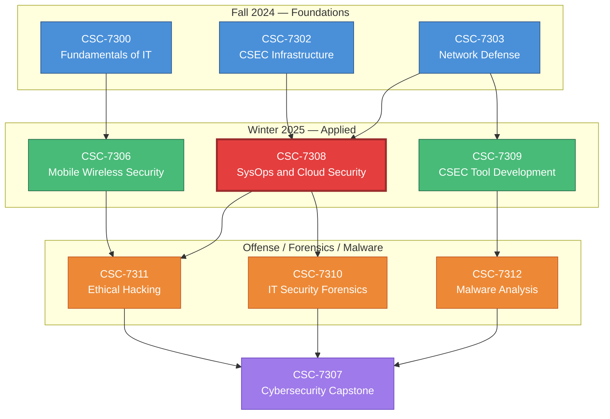

# Course Context — CSC-7308 in the Program

## Program: Cambrian College Postgraduate Cybersecurity Certificate

A two-term (Fall + Winter) graduate-level certificate program for students with undergraduate degrees in computing, engineering, or related fields who want to transition into or deepen careers in cybersecurity.

**Institution:** Cambrian College, Sudbury, Ontario, Canada
**Delivery:** Hybrid (synchronous lectures + hands-on labs)
**Duration:** Two academic terms

## Curriculum Map

### Fall 2024 (Foundations)

| Code | Course | Instructor |
|---|---|---|
| CSC-7300 | Fundamentals of IT | Robert Comtois |
| CSC-7301 | Intro to Cybersecurity | Maryam Ahmed |
| CSC-7302 | CSEC Infrastructure | Dr. Maryam Ahmed |
| CSC-7303 | Network Defense | Travis Czech |
| CSC-7304 | Business Contingency Planning | Kevin Bryanton |
| CSC-7305 | Policies and Compliance | Janice Cordeiro |
| CSC-7313 | Communications for Cybersecurity Professionals | Shawn McLaren |

### Winter 2025 (Applied & Specialized)

| Code | Course | Instructor | Pilot |
|---|---|---|---|
| CSC-7306 | Mobile Wireless Security | Mohamed Jbeili | 405 |
| **CSC-7308** | **SysOps and Cloud Security** | **Aditya Palshikar** | **406** ← this repo |
| CSC-7309 | CSEC Tool Development | Travis Czech | 407 |
| CSC-7310 | IT Security Forensics | Maryam Ahmed | 408 |
| CSC-7311 | Ethical Hacking | Jeff Caldwell | 409 |
| CSC-7312 | Malware Development & Analysis | Travis Czech | 410 |
| CSC-7307 | Cybersecurity Capstone | Myles Peterson | 411 |

Also: Spectrum Telecom Capstone stream (Anas Javaid).

## Where CSC-7308 Sits

CSC-7308 is the **operational defense** course in the Winter 2025 term. It answers: *"given the infrastructure we built in Fall 2024, how do we operate it securely in production?"*

## Adjacent Courses — Direct Connections

### CSC-7303 Network Defense (Fall 2024)
Provides the network-architecture foundation (zones, segmentation, monitoring) that CSC-7308 extends with NGFW operation and SIEM correlation.

### CSC-7302 CSEC Infrastructure (Fall 2024)
The hosts, VMs, and services that CSC-7308's controls defend.

### CSC-7311 Ethical Hacking (Winter 2025)
The adversary's perspective. Every defender control in CSC-7308 is something an attacker in CSC-7311 will try to bypass. Paired study across the two courses is highly recommended.

### CSC-7310 IT Security Forensics (Winter 2025)
Post-incident work. Where CSC-7308 ends (SOC alert → triage → containment), CSC-7310 begins (evidence preservation → analysis → reporting).

### CSC-7312 Malware Development & Analysis (Winter 2025)
What CSC-7308's WildFire and endpoint protection are classifying. Understanding malware internals deepens signature tuning.

### CSC-7307 Cybersecurity Capstone (Winter 2025)
Integrative project. CSC-7308's SOC/SIEM/cloud topics are common capstone scopes.

## Why This Course Matters

Most cybersecurity breaches are not due to exotic zero-days. They are due to:

- Misconfigured firewall rules
- Poor log hygiene (nobody reading the alerts)
- Missing endpoint coverage
- Cloud SRM misunderstandings
- Absent detection for reconnaissance or C2

Every one of those is a CSC-7308 topic. This is the **block-and-tackle** course of operational cybersecurity — the daily practice that prevents the headline breach.

---

*Last updated: 2026-04-04.*
